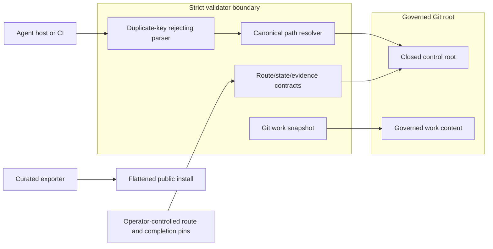

# Minimal Execution Loop Threat Model

> Status: accepted for Direction 2 after fresh implementation-alignment and integrity reviews
>
> Architecture: [`2026-07-10-minimal-execution-loop.md`](./2026-07-10-minimal-execution-loop.md)

## Scope

This threat model covers Direction 2: local `route-decision.v1` and `execution-state.v1` artifacts, the existing Prodcraft validator, the governed Git worktree, and flattened public skill export.

It does not treat Prodcraft as a network service. Direction 3 identity, event-store, scheduler, API, and multi-writer threats require a new threat model before implementation.

## Security Objectives

1. A writable control bundle cannot silently weaken a route or rewrite approved terminal evidence while the corresponding operator pin remains unchanged.
2. Historical or non-canonical state cannot authorize current completion.
3. Stale, replayed, or edited evidence cannot authorize a different route, attempt, execution basis, or work snapshot.
4. Control-artifact writes do not self-invalidate the governed work snapshot, and excluded control bytes remain content-bound.
5. Filesystem ambiguity, links, special files, Git configuration, and dirty submodules fail deterministically rather than bypassing validation.
6. A flattened public package does not ship broken relative references while claiming to be installable.
7. Structural validation never claims semantic quality, approver identity, or trusted time.

## Assets

| Asset | Security value |
|---|---|
| Operator-pinned route digest | External anchor for current reviewer-declared route content. |
| Operator-pinned completion digest | External anchor for the reviewed terminal attempt, verification commitment, and transition records. |
| Canonical live execution path | Selects current Direction 2 state instead of a historical snapshot. |
| Route predecessor/digest chain | Detects partial or stale route replacement inside the pinned bundle. |
| Lifecycle and phase histories | Preserve declared transition, block, resume, and checkpoint context. |
| Artifact obligation bindings | Prove that each reached gate has the declared assurance carrier. |
| Completion basis digest | Freezes non-terminal execution meaning for one completion attempt. |
| Verification and authorization evidence digests | Detect edits to evidence excluded from the governed work snapshot. |
| Governed work content digest | Binds completion evidence to current local repository content. |
| Curated package references | Preserve installed skill usability and prevent silent documentation breakage. |

## Actors And Assumptions

| Actor | Assumed capability | Trust posture |
|---|---|---|
| Operator/reviewer | Supplies the approved route digest, reviews the final terminal projection, and supplies its completion digest. | Trusted to choose the intended pins; identity is not authenticated by Direction 2. |
| Agent host | May write protocol artifacts and governed work, and invoke validation. | Untrusted for terminal authority without both operator pins and fresh validation. |
| Repository contributor | May change source, schemas, validator, and artifacts through source control. | Changes require normal review; a contributor controlling history and both operator pins is outside Direction 2. |
| Local filesystem/process | May contain links, special files, races, or changed content. | Untrusted input; strict validation confines and rechecks it. |
| Public package consumer | Installs the flattened curated surface without repository enforcement. | Receives guidance and explicit caveats, not strict runtime authority. |

## Trust Boundaries

Both operator pins cross a distinct authority boundary. If the host can replace the bundle and both supplied pins, Direction 2 cannot distinguish self-authorization from approval.

## Abuse Paths And Controls

| ID | Abuse path | Impact | Required controls | Residual risk |
|---|---|---|---|---|
| TM-01 | Agent deletes a route obligation, recomputes route digest, and updates state. | False gate/completion authorization. | Recompute route digest and compare to operator-supplied pin; route obligations are not owned by mutable state. | Operator may intentionally or mistakenly supply the new digest. |
| TM-02 | Host validates an old completed route/state pair after reroute. | Replay of obsolete completion. | Only canonical `execution-state.json` can authorize terminal state; route pin and predecessor/current binding must match. | Whole-repository and operator-pin rollback is outside scope. |
| TM-03 | Host edits phase history, block context, or artifact bindings after completion claim. | Verification applies to a different execution basis. | Reconstruct and compare `completion_basis_digest`; allow only the defined terminal suffix. | Source-control history remains the only proof that prior snapshots were not globally rewritten. |
| TM-04 | Rejected attempt evidence is reused for a later attempt. | Unverified retry becomes complete. | Append-only attempt IDs/revisions; binding includes current attempt and claim/basis digests. | Malicious full-bundle rewrite remains outside scope. |
| TM-04A | Phase events are backfilled before route entry or after a completion claim. | A snapshot appears to have completed phase gates that were never valid at that lifecycle point. | Replay the product automaton in one global sequence; allow phase events only while derived lifecycle state is `executing`. | Semantic value of the phase work remains review-led. |
| TM-05 | Verification, approval, or validator evidence is changed inside the excluded control root, with in-bundle hashes coordinated to match or between hash and semantic reads. | Authorization evidence changes without work-digest change, or digest and semantics refer to different bytes. | Strict JSON digest and parsing use one nonblocking, non-symlink regular-file descriptor snapshot; schema and terminal semantics reuse that payload; the closed bundle is recaptured before return; verification commitment enters claim/basis; every evidence ID maps to a local SHA-256 snapshot; final attempt/binding/terminal records must match the out-of-band completion pin. | Pins provide integrity/approval boundaries, not actor authentication; a malicious same-value swap around both captures remains a local race residual. |
| TM-06 | Relative reference escapes through `..`, symlink, Windows drive/UNC, URI, or intermediate link. | Reads attacker-selected local content or leaks files into evidence. | POSIX relative grammar; canonical realpath containment; `lstat` every component; reject all control/evidence symlinks. | Local kernel-level race is reduced, not eliminated. |
| TM-07 | Untracked symlink points outside repo, FIFO blocks read, socket/device behaves unexpectedly. | Data exposure, hang, or nondeterministic digest. | Governed-work symlink hashes `readlink` target only; reject FIFO/socket/device/special types without opening. | Unsupported filesystem semantics remain fail-closed. |
| TM-08 | Git environment/config/index, replace refs, Unicode/case settings, ignore rules, or blocking config includes change enumeration, execute hooks, hide staged bytes, or hide another task's control root. | Same work produces different identity, external code executes, validation hangs, or unverified content reaches delivery. | Scrub inherited `GIT_*`; disable replace refs, system/global config, fsmonitor, and untracked cache; fix snapshot-relevant config; bound every Git command; derive status from canonical entries vs `HEAD`; reject index content that is neither `HEAD` nor current worktree; reject unsafe `.git/info/exclude`; forcibly include other work roots even when `.prodcraft/` is ignored. | Tracked `.gitignore` remains a declared scope input for general worktree files; the local-config parser is contained by the command timeout rather than reimplemented. |
| TM-09 | Nested submodule changes or is uninitialized. | Work outside root evades snapshot. | Require initialized submodule HEAD equal recorded gitlink and nested status clean; otherwise fail terminal validation. | Recursive submodule content is not independently hashed in v1. |
| TM-10 | Work changes while the validator hashes it. | Evidence binds to a mixed snapshot. | Capture snapshot twice and require identical results; fail on change. | A malicious local process could race both captures; stronger filesystem snapshots are Direction 3/provider work. |
| TM-11 | Duplicate JSON keys show one value to a reviewer and another to parser logic. | Approval or digest ambiguity. | Strict artifacts use JSON duplicate-key rejection before schema validation. | Legacy YAML behavior is unchanged outside strict mode. |
| TM-12 | Host marks structural validation as semantic acceptance. | False assurance. | Separate assurance vocabulary; error/output categories; documentation caveat; semantic review remains explicit. | Humans may still misunderstand labels; review language is part of acceptance. |
| TM-13 | Curated export preserves lifecycle-tree links after flattening. | Installed skill references missing files. | Rewrite canonical skill links for sibling layout and validate every exported reference after generation. | External installers may impose additional transformations outside this repository. |
| TM-14 | Host-specific hook overrides or weakens a repository failure. | Host capture and inconsistent guarantees. | Host adapters may preflight or invoke repository validation but may not redefine authority or convert failure into pass. | A hostile host can ignore Prodcraft entirely; it then has no Prodcraft terminal authorization. |

## Fail-Closed And Evidence Requirements

- Missing route pin blocks every authority decision; missing completion pin yields only a candidate digest and blocks terminal authority.
- Historical/non-canonical state is reported as structural-only, never complete.
- Any unsafe or ambiguous path is an error.
- Any missing reached obligation is an error.
- Any subject/evidence digest mismatch is an error.
- Any unsupported filesystem object, dirty/unverifiable submodule, or unstable double capture is an error.
- Any invalid lifecycle, phase, completion attempt, or basis projection is an error.
- Any failure, skipped check, or remaining unverified item in `verification-record.v1` blocks completion.
- Validator output must name the artifact path and violated invariant without echoing sensitive file contents.

## Audit And Logging

Direction 2 emits local command output and protocol evidence; it does not add a telemetry service.

The final verification record should capture:

- exact validator command and version/work state;
- route and completion digest pins used, without treating them as secrets;
- canonical live state path;
- governed work snapshot algorithm and digest;
- checks passed/failed/skipped;
- adversarial review references;
- remaining unverified scope.

Logs must not include file contents, secrets, PII, or remote credentials. Paths should be repository-relative where possible.

## Residual Risks

1. Direction 2 does not authenticate approvers or operators.
2. An actor controlling repository history and both operator pins can forge a complete-looking history.
3. Self-reported timestamps prove ordering consistency only, not trusted time.
4. The work snapshot excludes ignored files and the closed control root by policy; external systems and dependencies are not automatically bound.
5. Double capture reduces but does not eliminate malicious local race attacks.
6. One-writer/source-control assumptions do not provide multi-agent concurrency control.
7. Curated packages remain guidance-only without source-repository schemas and validation.

## Downstream Security Acceptance

- route-obligation deletion plus digest recomputation fails against the original operator pin;
- old route/state cannot authorize after reroute with unchanged governed work;
- every frozen completion field and authorization evidence file has a failing mutation test;
- coordinated evidence and in-bundle digest rewrites fail against the original completion pin;
- traversal, POSIX absolute, Windows drive, UNC, URI, backslash, top-level/intermediate/final symlink cases fail;
- governed-work symlink retarget and executable-mode changes alter the digest;
- FIFO/special files and dirty/uninitialized submodules fail closed without blocking;
- Git user config does not change snapshot identity;
- blocking Git config includes time out and fail closed;
- duplicate strict JSON keys fail;
- flattened exported skill references all resolve;
- no unresolved P0/P1 security finding remains before ADR acceptance.
