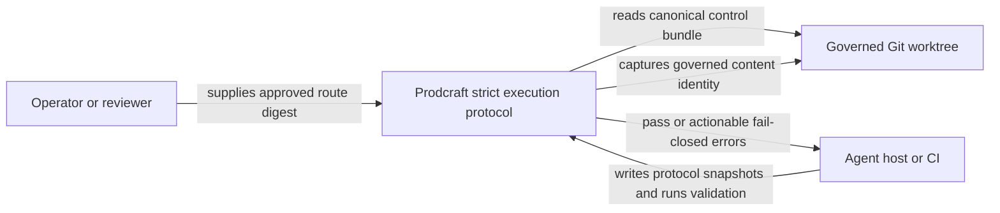
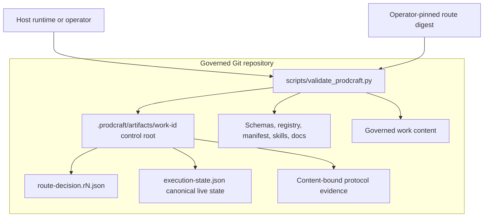
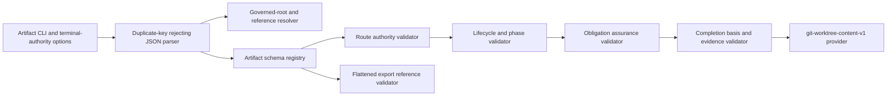
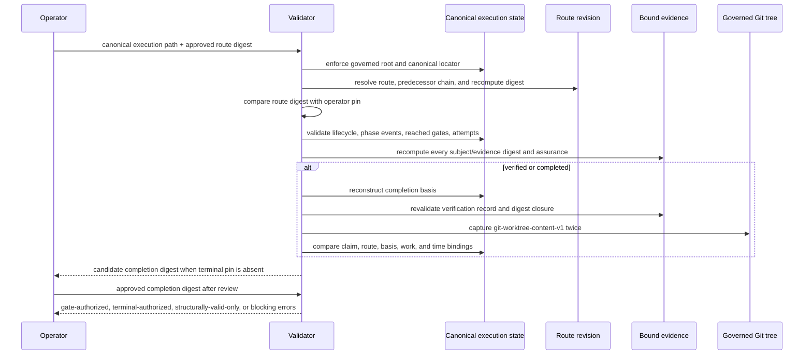

# Minimal Execution Loop Architecture

> Status: accepted and implemented; see [`2026-07-10-minimal-execution-loop-acceptance.md`](./2026-07-10-minimal-execution-loop-acceptance.md)
>
> Requirements: [`2026-07-10-minimal-execution-loop-requirements.md`](../plans/2026-07-10-minimal-execution-loop-requirements.md)
>
> Decision record: [`ADR-003`](../adr/ADR-003-repository-owned-execution-state.md)

## Selected Direction

Direction 2 is a local, repository-owned protocol with an explicit authority boundary:

1. `route-decision.v1` declares one approved route revision, its route-specific phase focus sequence, and its reviewer-declared gate obligations.
2. `execution-state.v1` is the unique live operational snapshot for lifecycle transitions, workflow-phase events, artifact bindings, block context, completion attempts, and completion bindings.
3. Strict terminal authorization requires all four:
   - the canonical live state path under the governed Git root;
   - a valid route/execution/evidence bundle;
   - an operator-supplied pinned route digest that is not read from the writable bundle.
   - an operator-supplied pinned terminal-completion digest over the final attempt, verification commitment, and terminal transition records.
4. The dedicated execution-authority validator performs schema, cross-file, state-machine, digest-closure, and live Git-worktree checks without changing `verification-record.v1` semantics. Generic `--artifact-instance` remains structural contract inspection only.
5. Existing workflows stay in legacy mode unless they explicitly adopt the strict artifacts.

The route/state split prevents mutable execution state from silently weakening a pinned route. The completion pin prevents a bundle writer from coordinating evidence and derived-digest rewrites after operator review. Direction 2 does not authenticate an operator or resist an actor that can replace the entire repository history and both out-of-band pins.

## Architectural Drivers

| Attribute | Stimulus | Response | Measure | Rank | Source |
|---|---|---|---|---|---|
| Completion integrity | A host presents missing, stale, replayed, or mutated completion evidence. | Strict terminal authorization fails and identifies the exact binding mismatch. | Every negative completion fixture exits non-zero with a specific error. | 1 | MEL-P0-05, MEL-P0-06 |
| Route authority | A writable route file drops an obligation and recomputes its digest. | Recomputed route digest no longer matches the operator pin; terminal authorization fails. | Obligation deletion plus digest recomputation fails. | 2 | MEL-P0-01, MEL-AC-01, MEL-AC-03 |
| Obligation completeness | Live state omits or downgrades a reached gate binding. | Obligations are loaded from the pinned route and assurance is revalidated. | Binding deletion and assurance downgrade fail. | 3 | MEL-P0-03, MEL-P0-04 |
| Compatibility | Existing consumers do not provide strict artifacts. | Legacy artifact and workflow validation remains unchanged. | The complete pre-change suite remains green. | 4 | MEL-P0-07 |
| Determinism and safety | Git config, symlinks, special files, submodules, or path ambiguity affect work identity. | A versioned config-independent content algorithm handles or rejects each case deterministically. | Repeated runs match; negative filesystem cases fail closed. | 5 | MEL-P0-08 |
| Inspectability | Work resumes without conversation history. | The live control bundle exposes route, lifecycle, phase cursor, reached gates, blocks, attempts, and evidence. | A reviewer can reconstruct the declared state from local files. | 6 | MEL-P0-01, MEL-P0-04 |
| Honest assurance | A schema-valid artifact is semantically poor or approval metadata is forged. | Outputs distinguish structural proof, declared approval, operator pinning, and semantic judgment. | No documentation or error upgrades structural validity into semantic/authentic proof. | 7 | MEL-P0-09 |
| Runtime extensibility | A later system needs concurrent agents, persistence, scheduling, and identity-aware approvals. | Stable Direction 2 domain semantics remain portable behind explicit seams without precommitting a future runtime envelope. | A fresh Direction 3 intake can change storage authority without silently redefining v1 semantics. | 8 | MEL-P0-10 |

## Architecture Style And Alternatives

The proposed style is **local protocol snapshots plus deterministic validation**. JSON carries state; JSON Schema closes shape; Python enforces invariants that span fields, files, state transitions, digests, and Git content.

Rejected or deferred alternatives:

- **One mutable execution file**: rejected because it would define and satisfy its own obligations.
- **Reinterpret `verification-record.v1`**: rejected because `claim_scope` is free text and route binding would be a breaking semantic change.
- **Trust a route file's self-declared digest**: rejected for terminal authority; an out-of-band operator pin is required.
- **Build a service now**: deferred until protocol adoption proves that persistence, scheduling, concurrency, or identity services are real requirements.

## C4 Context



The local runtime dependencies are Python, PyYAML/jsonschema as already used by the validator, and Git. There is no network listener or remote evidence fetch.

## C4 Containers



## Component Boundaries



All Direction 2 components remain functions in the existing scripts. Boundaries are explicit so a future runtime can replace filesystem and Git adapters without moving domain policy into a host-specific layer.

## Authority Model

### Governed root and canonical paths

The governed Git root is resolved from the top-level strict instance using local Git and then canonicalized with `realpath`.

For a `work_id` matching `^[A-Za-z0-9][A-Za-z0-9._-]{0,127}$`, the only terminal-authoritative paths are:

```text
<git-root>/.prodcraft/artifacts/<work_id>/execution-state.json
<git-root>/.prodcraft/artifacts/<work_id>/route-decision.r<revision>.json
```

Rules:

- `<git-root>`, `.prodcraft`, `artifacts`, `<work_id>`, and every referenced path component must not be symlinks.
- The canonical `execution-state.json` is the Direction 2 current-state selector.
- Historical state files may be schema- and internally valid, but the validator reports them as historical only and never authorizes a current terminal claim.
- Route revision `1` has no predecessor. Revision `N > 1` names revision `N-1` and its digest. The current route referenced by live state must match the operator pin.
- The predecessor chain proves internal continuity inside the pinned bundle. It does not cryptographically prove that repository history was never rewritten.

### Operator-pinned authority digests

Authoritative advancement uses a dedicated CLI mode rather than generic artifact validation:

```text
--authorize-execution-state <canonical-execution-state.json>
--approved-route-digest sha256:<64-lowercase-hex>
--approved-completion-digest sha256:<64-lowercase-hex>  # terminal only
```

Neither value is inferred from route or execution files. The route pin is required for every gate. For `verified` or `completed`, the validator reports a candidate terminal digest when the completion pin is absent; the operator reviews and supplies that digest out of band. The validator checks:

```text
operator_pin == recomputed_route_digest == execution_state.route_binding.route_digest
```

The terminal projection separately binds the final attempt, immutable verification commitment, completion binding, and exact terminal transition records to the completion pin. Coordinated bundle rewrites therefore change the candidate digest. The validator proves pin equality, not the identity or wisdom of the person supplying either pin.

## Normative Contract: `route-decision.v1`

### Top-level fields

| Field | Type | Cardinality | Rule owner |
|---|---|---:|---|
| `artifact` | const `route-decision` | 1 | schema |
| `schema_version` | const `route-decision.v1` | 1 | schema |
| `status` | const `approved` | 1 | schema |
| `work_id` | bounded identifier | 1 | schema |
| `route_id` | non-empty string | 1 | schema |
| `route_revision` | integer `>= 1` | 1 | schema + cross-file |
| `previous_route` | revision, digest, ref | 0..1 | schema + cross-file; required for revision > 1 |
| `route_digest` | `sha256:<hex>` | 1 | cross-file recomputation |
| `entry_phase` | manifest phase enum | 1 | schema contract validator |
| `workflow` | primary, overlays, focus sequence | 1 | schema + manifest parity |
| `obligations` | unique obligation objects | 1..N | schema + cross-field |
| `approved_by` | non-empty string | 1 | schema; declared identity only |
| `approved_at` | timezone-aware date-time | 1 | schema |
| `approval_evidence` | local ref and digest | 1 | path + content check |

### Workflow focus sequence

`workflow.focus_sequence[]` is a non-empty route-specific order in which this work item focuses on lifecycle phases. Cross-field validation requires `workflow.focus_sequence[0] == entry_phase`. It does not claim that an agile workflow has only one active engineering lens globally. Repeated phase IDs are allowed when the approved route intentionally revisits a phase.

### Obligation fields

| Field | Type | Rule |
|---|---|---|
| `id` | unique bounded string | unique within route revision |
| `artifact` | manifest artifact-flow name | must exist in artifact flow |
| `gate` | lifecycle-transition or phase-checkpoint object | closed discriminated union |
| `assurance` | `presence`, `structural_valid`, or `approval_accepted` | exact, no downgrade |

Lifecycle gate fields are `kind`, `from_state`, and `to_state`. Phase gate fields are `kind`, `phase_index`, and `checkpoint` (`entered` or `exited`).

At least one `intake-brief` obligation with `approval_accepted` assurance is required for `received -> routed`.

### Route digest

```text
route_digest = sha256(canonical_json(route_without_route_digest))
```

`canonical_json` means UTF-8, sorted object keys, no insignificant whitespace, JSON booleans/null, and arrays in declared order. Duplicate JSON keys are rejected before parsing. The digest is content identity; terminal authority still requires the operator pin.

## Normative Contract: `execution-state.v1`

### Top-level fields

| Field | Type | Cardinality | Rule owner |
|---|---|---:|---|
| `artifact` | const `execution-state` | 1 | schema |
| `schema_version` | const `execution-state.v1` | 1 | schema |
| `work_id` | same as route | 1 | cross-file |
| `state_revision` | integer `>= 1` | 1 | cross-field; equals the highest global `recorded_sequence` |
| `updated_at` | timezone-aware date-time | 1 | schema |
| `route_binding` | ref, route ID/revision/digest | 1 | cross-file + operator pin |
| `lifecycle_state` | canonical state enum | 1 | state validator |
| `workflow_cursor` | phase index, phase ID, checkpoint | 0..1 | absent before first `entered(0)`; required afterward and derived from phase events |
| `lifecycle_transitions` | ordered transition objects | 1..N | state validator |
| `phase_events` | ordered entered/exited events | 0..N | empty before execution focus begins; phase validator afterward |
| `artifact_bindings` | reached-gate bindings | 0..N | obligation validator |
| `block_contexts` | historical block/resume context | 0..N | state validator; each binds a blocked transition and, when resumed, the exact resume transition |
| `completion_attempts` | immutable claim bases plus append-only outcomes | 0..N | completion validator |
| `current_completion_attempt_id` | attempt identifier | 0..1 | conditional |
| `previous_execution` | archived state ref and digest | 0..1 | required when route revision > 1 |

### Lifecycle transition fields

Each transition contains `recorded_sequence`, `record_digest`, `from_state`, `to_state`, `occurred_at`, `reason`, and content-bound `evidence_refs[]`.

The canonical matrix is:

```text
received -> routed
routed -> gated
gated -> executing
executing -> blocked | completion_claimed | rerouted
blocked -> executing | rerouted
completion_claimed -> verified | rejected
rejected -> gated | rerouted
verified -> completed
```

`completed` and `rerouted` are terminal for that route revision. A blocked transition requires a new block-context record; resumption names that context.

### Workflow cursor and phase events

Each phase event contains `recorded_sequence`, `record_digest`, `kind` (`entered` or `exited`), `phase_index`, `phase`, `occurred_at`, and content-bound `evidence_refs[]`.

Rules:

1. The first event is `entered` for focus-sequence index 0.
2. `entered(i)` must be followed by `exited(i)`.
3. `exited(i)` may be followed by `entered(i+1)` when another focus phase exists.
4. Final `exited(N-1)` is representable: the cursor remains at index `N-1` and phase `focus_sequence[N-1]` with checkpoint `exited`.
5. The final focus phase must be exited before `executing -> completion_claimed`; every obligation on that exit or claim transition must already be satisfied.
6. Reordering or skipping focus entries requires a new route revision.

This is a task-local focus sequence, not a denial of concurrent agile phase lenses elsewhere in the workflow.

### Global execution order

Lifecycle transitions, phase events, and artifact-binding activations share one `recorded_sequence` namespace. The union of those records must contain every integer from `1` through top-level `state_revision` exactly once.

- Derived product state starts at lifecycle `received` with no workflow cursor at sequence 0.
- Records are replayed strictly by global sequence to derive lifecycle and workflow state.
- Routed, gated, and newly rerouted replacement states may have `phase_events: []` and no `workflow_cursor` before the first legal `entered(0)` event.
- Once any phase event exists, `workflow_cursor` is required and must equal the cursor derived from the last phase event.
- An artifact binding carries the sequence at which it became active.
- A lifecycle or phase gate is authorized only when every required binding has a lower `recorded_sequence` than the gate-crossing transition/event.
- Artifact bindings may activate in any non-terminal lifecycle state before their gate, subject to route assurance rules.
- A phase event is legal only when the lifecycle state derived immediately before that event is `executing`.
- The first `entered(0)` event occurs strictly after `gated -> executing`.
- No phase event is legal while lifecycle is `received`, `routed`, `gated`, `blocked`, `completion_claimed`, `verified`, `rejected`, `completed`, or `rerouted`. After `blocked -> executing`, phase events may resume from the unchanged cursor.
- `occurred_at` is descriptive and is not used as the authority order.
- A completion attempt stores `claim_cut_sequence`, equal to its `executing -> completion_claimed` transition sequence.
- Completion-basis reconstruction selects the as-of projection at that cut sequence, so a prior rejected attempt remains reproducible after later work and retries.
- A `block_context` binds the transition that entered `blocked`. When execution resumes, that same context must name the exact `blocked -> executing` `resume_transition_sequence`; an unrelated or missing context cannot resume work.

### Artifact binding fields and assurance

Every reached obligation has exactly one binding with:

- `obligation_id`
- matching `artifact`
- POSIX-style local `ref`
- `subject_sha256`
- exact `assurance`
- unique `recorded_sequence`

Additional fields by assurance:

| Assurance | Required fields | Revalidated now | Not proven |
|---|---|---|---|
| `presence` | subject ref and digest | regular file exists and digest matches | schema, semantics, approval |
| `structural_valid` | validator ID/version/check set, result `passed`, evidence ref/digest | subject is a registered artifact and current validator passes it; evidence digest matches | semantic adequacy |
| `approval_accepted` | approval status, approver, time, subject digest, approval evidence ref/digest | subject and evidence digests match; status is accepted | actor authenticity or judgment quality |

Recorded validator success never replaces revalidation. Self-reported timestamps provide ordering evidence only; they are not trusted clocks.

## Completion Attempts And Frozen Basis

### Attempt model

`completion_attempts[]` is append-only by contract. Each attempt contains an immutable claim base:

- unique `attempt_id`
- monotonic `attempt_revision` within the route
- claim and free-text claim scope
- `claim_digest`
- `completion_basis_digest`
- `claim_cut_sequence`
- route ID/revision/digest
- governed work snapshot
- immutable `verification_commitment` with the verification-record ref/digest, exact evidence snapshot bindings, and work snapshot
- `claimed_at`
- terminal transition sequence/digest references for zero or more allowed outcomes (`rejected`, `verified`, `completed`)

`current_completion_attempt_id` points to the latest attempt while the lifecycle is `completion_claimed`, `verified`, or `completed`. A rejected attempt remains in history. After `rejected -> gated -> executing`, a later completion claim appends a new attempt with a new revision. Evidence from attempt 1 cannot authorize attempt 2.

### Claim digest

```text
claim_payload_projection = immutable claim fields excluding
  claim_digest, completion_basis_digest, terminal transition refs,
  completion binding, and all outcomes

claim_digest = sha256(canonical_json(claim_payload_projection))
```

The claim digest is computed first. The completion-basis projection includes that computed claim digest and excludes only `completion_basis_digest`, so there is no digest cycle.

The verification commitment exists before `executing -> completion_claimed`, enters both the claim payload and completion basis, and is copied exactly into the later completion binding. Terminal transition digests are appended afterward. This ordering avoids a digest cycle while ensuring any evidence-binding rewrite changes the final externally pinned terminal projection.

### Completion basis digest

The basis freezes all non-terminal execution meaning at the moment the lifecycle reaches `completion_claimed`:

```text
completion_basis_digest = sha256(canonical_json(preterminal_projection))
```

`preterminal_projection` is reconstructed as of `claim_cut_sequence` and includes:

- work and pinned route binding;
- lifecycle records with `recorded_sequence <= claim_cut_sequence`;
- phase records and artifact-binding activations with `recorded_sequence <= claim_cut_sequence`;
- workflow cursor derived at that cut;
- block contexts whose transition sequence is at or before the cut;
- all prior completion attempts and their content-addressed terminal transition references;
- the current attempt's immutable claim fields.

It excludes only:

- top-level `state_revision` and `updated_at`;
- current attempt's `completion_basis_digest` field itself;
- current attempt terminal transition references appended after claim;
- current attempt completion binding;
- records with `recorded_sequence > claim_cut_sequence` that are part of the exact allowed terminal suffix;
- top-level lifecycle state changes that exactly mirror that suffix.

For terminal validation, the validator reconstructs this projection from the current snapshot and recomputes the digest. Any other history, phase, binding, block, claim, route, or evidence mutation invalidates the binding.

### Completion binding

For `verified` or `completed`, the current attempt binds:

- attempt ID/revision;
- claim digest;
- completion basis digest;
- route ID/revision/digest and operator pin equality;
- `verification-record.v1` local ref and `verification_record_sha256`;
- verification record work-state binding;
- one additive `evidence_bindings[]` entry for every verification-record evidence ID, mapping that opaque evidence identity to a control-root-local snapshot ref and SHA-256;
- governed work snapshot;
- every authorization evidence digest reachable from the completion basis.
- every allowed terminal transition sequence and `record_digest` appended after the cut.

The validator re-reads and revalidates the verification record. `claim_scope` remains free text. `work_state_ref.ref` retains Git-ref semantics, and `evidence_refs[].ref` remains the existing opaque command/file/test/review description. Strict validation never resolves those legacy fields as paths. Only the additive envelope binds route identity and content-addressed local evidence snapshots.

Each lifecycle transition uses:

```text
record_digest = sha256(canonical_json(transition_without_record_digest))
```

The completion binding records the exact digest for `completion_claimed -> verified` and, when present, `verified -> completed`. Changing terminal reason, time, evidence, or any other transition field changes the digest and fails validation. A rejected transition is content-addressed and closes that attempt but never forms a completion binding.

The unchanged basis authorizes only:

```text
completion_claimed -> verified -> completed
```

`terminal_authority.v1` projects the current attempt (including its verification commitment and completion binding), exact terminal transition records, route binding, lifecycle state, state revision, `updated_at`, cursor, and predecessor binding. `terminal-authorized` requires its digest to equal `--approved-completion-digest`. Moving from `verified` to `completed` changes this projection and requires a new explicit completion pin.

The normal terminal suffix does not self-invalidate. Rejection ends that attempt and requires a new attempt before later verification.

## Reroute Successor Protocol

When the canonical live state reaches `rerouted`:

1. copy it byte-for-byte to `history/execution-state.r<route_revision>.s<state_revision>.<sha256>.json` under the same work control root;
2. create route revision `N+1` with a `previous_route` binding to revision `N` and its digest;
3. create a replacement `execution-state.json` at lifecycle state `routed` whose first route-scoped transition is `received -> routed` and whose `previous_execution` binds the archived rerouted state ref/digest;
4. replace the canonical selector using same-filesystem atomic rename;
5. require a new operator pin equal to the new route digest before any authoritative gate advancement.

The archived route/state pair remains structurally inspectable. It cannot be `gate-authorized` or `terminal-authorized` because it is not at the canonical selector and does not match the new operator pin.

## Canonical Control Root And Reference Safety

Strict references use a POSIX-style relative grammar. Only additive path-bearing fields introduced by `route-decision.v1`, `execution-state.v1`, and the completion envelope are resolved relative to the current work control root: route predecessor, previous execution, artifact subject, validator evidence snapshot, approval evidence snapshot, lifecycle evidence snapshot, verification-record file, and additive `evidence_bindings[].local_ref`. No strict path is relative to the process working directory or Git root.

Legacy `verification-record.v1` fields are explicitly excluded from path resolution:

- `work_state_ref.ref` remains a Git ref;
- `work_state_ref.diff_ref` remains a work-state digest/identifier;
- `evidence_refs[].ref` remains opaque evidence description;
- `checks_run[].evidence_ref` remains an evidence ID.

The grammar requires:

- no leading `/`;
- no `..` segment;
- no backslash;
- no Windows drive prefix;
- no UNC prefix;
- no URI scheme;
- no NUL byte.

The top-level instance, every intermediate component, and final target are checked with `lstat` and canonical containment. Symlink components and symlink targets are rejected for control/evidence references. Final referenced subjects must be regular files.

Strict control artifacts are JSON only and use duplicate-key rejection. Legacy YAML artifact validation remains unchanged.

All content digests use `prodcraft-canonical-json-v1`:

- input is duplicate-free UTF-8 JSON;
- object member names are ASCII and sorted by byte order;
- strings are valid Unicode, preserved without normalization, with JSON-required control/quote/backslash escapes;
- arrays preserve order;
- numbers are integers in `[-9007199254740991, 9007199254740991]`;
- floats, negative zero, NaN, and infinity are forbidden;
- serialization has no insignificant whitespace and is encoded as UTF-8.

The Python implementation is the Direction 2 canonicalizer and is protected by Unicode, escaping, key-order, and numeric-boundary fixtures.

The current work-item control root is a reserved namespace. Only that root is excluded from this work item's governed content digest. Other work-item roots remain governed content, so another task's control-state change conservatively invalidates the current task's work snapshot. This rule overrides repository ignore behavior inside `.prodcraft/artifacts/`: even when a tracked `.gitignore` excludes `.prodcraft/`, files under other work-item roots are forcibly enumerated and hashed.

The validator enumerates the excluded current root and rejects:

- unsupported file types;
- path or symlink escapes;
- non-artifact files not referenced and content-bound by the live route/execution closure;
- governed implementation files presented as protocol evidence.

This closed control-bundle invariant permits the control root to be excluded from the governed work snapshot without creating an unbound authorization channel.

## `git-worktree-content-v1`

### Snapshot fields

- `algorithm_id: git-worktree-content-v1`
- `scope_policy_id: repo-worktree-excluding-bound-control-v1`
- current `HEAD`
- `status: clean | dirty`
- `content_digest: sha256:<hex>`
- `captured_at`

### Governed entry set

The algorithm uses Git plumbing with fixed command arguments, removes inherited `GIT_*` overrides, disables system/global config and `core.fsmonitor`, and fixes snapshot-relevant config. The only general-worktree ignore rules accepted are tracked `.gitignore` files covered by the same content snapshot. Strict validation fails when `.git/info/exclude` contains a non-comment rule or when any effective `.gitignore` is untracked. It enumerates tracked files plus untracked files not ignored by those governed rules, then forcibly adds every file under other `.prodcraft/artifacts/<other_work_id>/` roots, excluding only the validated current work control root.

For each sorted UTF-8 POSIX relative path, the digest record includes unambiguous length delimiters around:

- path bytes;
- entry type;
- executable/mode bits;
- content length and content bytes.

Entry handling:

- regular file: hash bytes without text conversion;
- symlink in governed work: use `lstat` and hash the link target from `readlink`, never target contents;
- FIFO, socket, device, or unsupported special file: fail closed without opening it;
- submodule: require initialized, current submodule HEAD equal to the recorded gitlink, and nested status clean; otherwise fail closed; include gitlink identity in the digest.

The implementation must not hash porcelain diff output and must not execute textconv or external diff drivers. It captures the snapshot twice around terminal validation and fails if the two captures differ, reducing local read-race/TOCTOU risk.

`status` is derived by comparing the same canonical current entries with the `HEAD` tree, not from config-sensitive porcelain output. Index entries may equal `HEAD` or the verified current worktree value; an index entry containing a third, unverified version fails closed. This permits unstaged dirty work and staged work that matches current bytes without allowing a later commit to land content absent from the snapshot.

For strict dirty mode, `verification-record.v1.work_state_ref.diff_ref` equals this content digest. Strict mode also records the content digest for a clean tree in the additive completion envelope.

Generally ignored files and the current control root are outside the governed work scope; other work-item control roots are the explicit exception and remain governed. A completion claim must not represent excluded content as work proven by this snapshot.

## Strict Validation Flow



The output and exit contract is explicit:

- `gate-authorized`: canonical live path, operator pin, state/gate ordering, and reached obligations pass for a non-terminal state;
- `terminal-authorized`: canonical live path, route pin, completion pin, and all terminal checks pass;
- `structurally-valid-only`: historical or non-canonical instance is internally valid but has no current authority;
- error: an invariant fails.

`--authorize-execution-state` exits zero only for `gate-authorized` or `terminal-authorized`. Structural-only, missing-pin, historical, and non-canonical results exit non-zero in authority mode. Generic `--artifact-instance` remains schema/contract inspection only and never emits an authority result. Every authoritative lifecycle transition or phase checkpoint, not only terminal completion, requires pin equality.

Text remains the default presentation. After successful argument parsing, `--output-format json` emits exactly `status`, `authority`, `candidate_completion_digest`, and `errors`; it carries the candidate as data instead of requiring a host to parse human error text. Presentation never changes domain-validation exit codes or upgrades candidate-only state to authority. Standard `argparse` usage errors remain on stderr with exit code 2. This unversioned local projection is not the future Direction 3 host-adapter contract; that boundary requires an explicit version and migration policy before adoption.

## Failure Semantics

| Failure | Result |
|---|---|
| Missing operator pin for any authoritative gate/terminal decision | Structural-only result; no advancement authority. |
| Route digest differs from operator pin | Blocking authority error. |
| Missing or mismatched terminal completion pin | Candidate-only/non-authoritative result or blocking authority error. |
| Historical/non-canonical state | Structural-only result; never terminal authorization. |
| Invalid route predecessor chain | Blocking route error. |
| Missing reached obligation or assurance downgrade | Blocking gate error. |
| Invalid lifecycle or phase event | Blocking state error. |
| Mutated completion basis or evidence digest | Blocking replay error. |
| Git snapshot changes during capture | Blocking race error. |
| Dirty/unverifiable submodule or special file | Blocking work-snapshot error. |
| Semantic adequacy cannot be determined | Remains explicit review responsibility; no semantic pass is emitted. |

## Trust And Threat Model

### In scope

- model or host loses conversation state;
- agent skips or deletes only an execution binding;
- stale route, state, claim, or evidence is reused;
- route file is changed without updating the operator pin;
- completion evidence is edited after capture;
- source content changes after verification;
- unsafe local paths, symlinks, special files, or Git configuration affect validation;
- curated export flattens packages and breaks references silently.

### Outside Direction 2

- attacker controls the entire repository history and both operator-provided pins;
- cryptographic approver identity;
- trusted wall-clock ordering;
- remote artifact authenticity;
- multiple concurrent state writers.

A future Direction 3 intake must define identity, concurrency, persistence, and recovery boundaries if those become approved requirements.

## Compatibility And Public Export

### Legacy mode

- Existing schemas and workflows remain valid.
- `verification-record.v1.claim_scope` remains free text.
- Schema validity does not imply strict execution or semantic quality.

### Strict mode

- New route/execution artifacts and operator pin are explicit opt-in inputs.
- Strict mode proves declared route, state, digest closure, and work freshness inside the documented threat model.

### Public flattened install

The curated exporter must rewrite canonical lifecycle-tree skill links for the flattened sibling layout. For example, a canonical cross-phase link becomes `../pc-security-audit/SKILL.md` in the installed package.

Curated validation must check:

- frontmatter name and description load successfully;
- description bounds and security-minimal rules still pass;
- every packaged relative file reference resolves inside the exported tree;
- exported content contains no machine-specific paths;
- generated tree equals the checked-in curated tree.

This closes the existing silent failure where cross-phase references such as `../../05-quality/...` survive flattening but point to missing files after installation.

## Deployment Topology

Direction 2 runs inside a local Git checkout:

```text
operator or host
  -> Python validator + Git
       -> governed repository
            -> .prodcraft/artifacts/<work_id>/
            -> governed source and deliverables
```

No daemon, database, queue, socket, service account, remote API, or public listener is introduced.

## Proposed Direction 3 Compatibility Hypotheses (Non-Normative)

Direction 3 remains a possible future standalone runtime. It is not part of this implementation slice, and the shapes below are compatibility hypotheses rather than accepted runtime requirements or implementation contracts.

### Proposed authority transition

- Direction 2: canonical live snapshot plus operator-pinned route digest is gate-authoritative; terminal authority additionally requires the externally pinned final completion projection.
- A future Direction 3 design could make one append-only work-item event stream authoritative, with route and execution snapshots projected from the same stream to avoid dual authority.
- A possible import shape is a versioned `direction2_snapshot_imported` genesis event containing source route/state/evidence digests and operator approval evidence.

### Proposed event envelope

```text
event_schema_version
payload_schema_version
event_id
event_type
work_id
route_id
route_revision
aggregate_revision
expected_revision
idempotency_key
occurred_at
recorded_at
actor_ref
causation_id
correlation_id
payload
evidence_refs[]
```

Proposed, non-normative compatibility hypotheses:

- idempotency compares a canonical request fingerprint over every caller-controlled semantic field: event/payload versions, event type, work/route identity, expected revision, idempotency key, actor, causation/correlation, occurred-at, payload, and evidence refs;
- append first looks up `(work_id, idempotency_key)`; an existing key with the same fingerprint returns the original event even though current aggregate revision has advanced, while the same key with a different fingerprint is a conflict;
- only an unseen idempotency key proceeds to the atomic CAS transaction that checks `expected_revision == current_revision`, assigns `aggregate_revision = current_revision + 1`, and enforces event-ID/idempotency uniqueness;
- revision gaps, duplicate aggregate revisions, unknown event types, and unsupported payload versions halt projection;
- payload upcasters are deterministic, versioned, and preserve documented v1 compatibility semantics rather than freezing vocabulary forever;
- projection records contain `projection_schema_version`, `projected_through_revision`, and `last_event_id`;
- rebuild replays the authoritative stream from genesis in aggregate-revision order and must reproduce the same projection digest;
- `occurred_at` is actor-claimed context; `recorded_at` and aggregate revision establish store order.

### Proposed ports

| Port | Responsibility | Direction 2 adapter | Direction 3 boundary |
|---|---|---|---|
| `AuthorityProvider` | Supply approved route and completion authority. | Operator route/completion digest pins. | Identity-aware approval policy. |
| `EventStore` | Atomically append authoritative work events. | Deferred. | Durable log with CAS and idempotency. |
| `ProjectionStore` | Store rebuildable route/execution views. | Local JSON snapshots. | Versioned projection database. |
| `WorkSnapshotProvider` | Capture governed work identity. | Local Git content provider. | Git or artifact-store adapters. |
| `ArtifactResolver` | Resolve and verify evidence. | Closed local control root. | Content-addressed artifact store. |
| `ApprovalProvider` | Bind actor approval to subject digest. | Declared metadata plus route pin. | Authenticated approval service. |
| `SchedulerPort` | Resume queued or blocked work. | Deferred. | Queue/workflow scheduler. |
| `HostAdapter` | Translate host actions into canonical commands/events. | CLI invocation. | Claude/Codex/Gemini adapters. |

A future Direction 3 intake must explicitly define and justify conflict semantics for route, approval, completion, and terminal events; this document does not accept a conflict policy.

### Deferred Direction 3 choices

- database/event-log technology;
- process and tenancy topology;
- authentication and actor identity;
- network API shape;
- scheduler retry policy;
- retention, archival, and deletion;
- HA, disaster recovery, and operational SLOs;
- UI and dashboards.

Each requires a new approved intake, requirements set, threat model, and decision record.

## Trade-Off Analysis

| Decision | Gain | Cost | Exit trigger |
|---|---|---|---|
| Operator-pinned route digest | Prevents the writable bundle from silently weakening current authority. | Requires an out-of-band value and does not authenticate the operator. | Replace behind `AuthorityProvider` when identity-aware approval is required. |
| Operator-pinned completion digest | Prevents coordinated post-review evidence/binding/digest rewrites from preserving terminal authority. | Requires explicit approval for `verified` and again for `completed`; does not authenticate the operator. | Replace behind authenticated approval/signature policy in Direction 3. |
| Canonical live state path | Distinguishes current authority from historical validity. | One-writer filesystem convention. | Move authority to event-store head in Direction 3. |
| Completion basis digest | Detects mutation outside the allowed terminal projection. | Canonical projection logic must stay stable and tested. | Version through a new schema if frozen-field semantics change. |
| Closed control root | Avoids self-hash cycles while binding authorization material. | Strict layout and enumeration rules. | Replace with a content-addressed artifact store. |
| Full worktree content digest | Avoids diff formatting/config drift; file bytes stream through the existing canonical digest instead of being held whole in memory. | More I/O than hashing a diff. | Add optimized providers only if they prove identical semantics. |
| Additive strict mode | Preserves compatibility and reversibility. | Legacy users remain unenforced. | Mandatory migration requires separate approval and versioning. |

## Architecture Fitness Functions

| Driver | Check | Pass rule |
|---|---|---|
| Route authority | Delete a route obligation, recompute internal digests, keep old operator pin. | Terminal authorization fails on pin mismatch. |
| Terminal external anchor | Rewrite the verification commitment, claim, completion basis, completion binding, and their in-bundle digests coherently while keeping the original completion pin. | Terminal authorization fails on completion-pin mismatch; a missing completion pin yields only a candidate digest and never authority. |
| Current selector | Reroute without changing governed work, then validate the old pair. | Old pair is structural-only or rejected; never terminal-authorized. |
| Completion freeze | Mutate every frozen projection field independently. | Every mutation fails; only the defined terminal suffix passes. |
| Completion retry | Reject attempt 1, append attempt 2, try evidence from attempt 1. | Attempt 2 can pass with fresh evidence; attempt-1 replay fails. |
| Phase model | Test one-phase entry/exit, repeated phases, final exit, and agile focus semantics. | Valid sequences pass; jump/reorder/checkpoint errors fail. |
| Product automaton | Place phase events before intake/routing, before executing, while blocked, after claim, and after terminal state. | Every out-of-window phase event fails; resumed executing state may continue the prior cursor. |
| Pre-focus state | Validate routed and gated states with no phase events or cursor, then enter phase 0 after executing. | Pre-focus fixtures pass; premature cursor or event fails. |
| Route entry consistency | Use an empty focus sequence or one whose first phase differs from `entry_phase`. | Both route fixtures fail cross-field validation. |
| Digest closure | Mutate verification, approval, or validator evidence in control root. | Terminal authorization fails on content digest mismatch. |
| Work identity | Toggle Git config; add a blocking config include; add replace refs; ignore `.prodcraft/`; mutate another work root; retarget symlink; chmod; add FIFO; or hide nested submodule changes. | Config and current control changes do not change digest; Git calls may run slowly but fail after the fixed 300-second liveness guard; other work roots and supported content do; unsupported or hidden states fail closed. |
| Path safety | Test top-level/intermediate/final symlink, traversal, URI, drive, UNC, and backslash forms. | Every escape or ambiguous form fails. |
| Compatibility | Run the complete discovered pre-change suite plus legacy fixtures. | All prior valid behavior remains green. |
| Public runtime | Generate the flattened curated tree and validate every frontmatter and packaged relative reference. | Every package loads and every reference resolves. |
| Direction 3 seam | Before implementation, run a fresh intake and approve requirements/ADRs for identity, concurrency, persistence, recovery, idempotency, migration, and operating boundaries. | No runtime or fixture claims conformance to the hypotheses above until those reviewed contracts exist. |

## Implementation Boundary

This slice includes:

- `route-decision.v1` and `execution-state.v1` schemas/templates;
- artifact registry and manifest-flow integration;
- governed-root, route-pin, state, phase, obligation, completion, evidence-closure, and Git-worktree validation;
- focused positive and adversarial fixtures;
- relevant intake, verification, gateway, README, and architecture guidance;
- curated export link rewriting and installed-reference validation;
- a self-hosted ignored acceptance bundle and final verification record.

This slice excludes:

- mandatory strict mode in every workflow;
- a new skill solely to operate state;
- host hooks, persistent services, identity providers, remote APIs, schedulers, queues, or databases;
- semantic scoring of requirements, architecture, reviews, or tests;
- unrelated skill benchmark reruns.

## Open Decisions

No known Direction 2 semantic decision remains open after architecture review. If implementation cannot make canonical path handling or `git-worktree-content-v1` deterministic for the supported environment, work must stop and return to architecture rather than weakening the guarantee.
