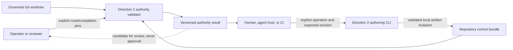
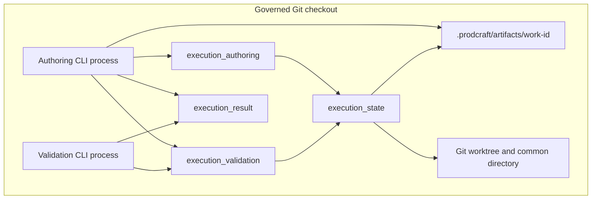

# Direction 2 Adoption Architecture

> Status: accepted — 2026-07-12
>
> Extends: [`2026-07-10-minimal-execution-loop.md`](./2026-07-10-minimal-execution-loop.md)
>
> Decision record: [`ADR-004`](../adr/ADR-004-direction2-adoption-boundary.md)

## Decision Summary

Direction 2 remains the authoritative repository-owned protocol. This design adds the minimum adoption surface needed to operate that protocol without hand-editing derived sequence numbers, digests, bindings, or terminal projections:

1. a separate authoring module that performs pure, deterministic route/state transformations by reusing the existing canonical projection functions;
2. a thin CLI that performs safe reads, expected-revision checks, validation, capacity checks, and same-filesystem atomic replacement;
3. additive, versioned authority and authoring result projections for machine consumers;
4. capacity telemetry and a measured rollout gate, without implementing rollover before evidence requires it.

This design does not narrow the governed worktree, relax `verified -> completed` repinning, split the existing validator wholesale, or implement a Direction 3 runtime.

## Context And Problem

The accepted Direction 2 validator is strong enough to reject invalid authority claims, but its authoring surface is limited to schemas and templates. A conforming writer currently has to coordinate global sequence numbers, transition digests, route and completion projections, work snapshots, verification commitments, completion bindings, retry identities, and reroute history manually.

That is not merely inconvenient. It creates three adoption hazards:

- a host may bypass strict mode because valid artifacts are too difficult to produce;
- a host may copy derived-digest logic and drift from the repository validator;
- a machine integration may bind itself to the current unversioned four-field JSON projection and make later evolution breaking.

The architecture must improve usability without collapsing the trust boundary. An authoring tool may construct protocol content and report a candidate digest. It may consume an explicitly supplied operator pin to verify a precondition. It must never designate its own candidate as approved, persist a pin, or automatically reuse a candidate as a pin. Direction 2 does not authenticate who re-supplies the value; an actor controlling both the bundle and the explicit pin remains outside its trust model.

## Architectural Drivers

| Attribute | Stimulus | Required response | Fitness measure | Rank | Source |
|---|---|---|---|---:|---|
| Authority separation | The same host writes route/state artifacts and invokes the authoring CLI. | The tool may return candidates but never auto-forwards one as approval; authority still requires a separately supplied explicit pin. | Removing every separately supplied pin leaves exit nonzero and authority null; no pin is written into the control bundle. | 1 | ADR-003 trust boundary |
| Correct-by-construction authoring | A user advances a valid work item through a supported lifecycle path. | One command produces the coupled records and derived digests required by that operation. | Normal, block/resume, and reject/retry scenarios complete with zero manual edits to derived fields. | 2 | 2026-07-10 retrospective |
| Compatibility | Existing callers use text output or `--output-format json`. | Existing fields, messages, and exit codes remain unchanged. | The complete pre-change suite and explicit golden CLI fixtures remain green. | 3 | MEL-P0-07 |
| Fail-closed mutation | A lock-cooperating authoring process writes against a newer state revision or produces an invalid candidate state. | The write is rejected before canonical replacement. | Expected-revision mismatch and every invalid candidate leave the canonical file byte-identical within the local authoring boundary. | 4 | Direction 2 current-selector model |
| Bounded state growth | An append-only state approaches the 16 MiB strict limit. | The authoring result reports exact serialized bytes and headroom; rollout stops at the evidence threshold. | Every successful mutation reports capacity; a candidate at or above 12 MiB emits a warning, and a candidate above 16 MiB is not written. | 5 | P2 hardening and retrospective |
| Maintainability | New authoring and machine-output behavior is added beside a 2,146-line validator module. | New responsibilities enter focused modules without a speculative full rewrite. | No authoring mutation or versioned renderer is implemented in `tools/execution_state.py`; canonical digest semantics remain characterized. | 6 | Final adversarial review |
| Direction 3 reversibility | Future work needs identity, multi-writer concurrency, scheduling, or durable recovery. | Direction 2 domain invariants remain portable behind explicit seams. | No Direction 3 service or event-store dependency enters this implementation; a fresh intake remains mandatory. | 7 | ADR-003 and user-approved scope |

## Architecture Owner Dispositions

| Reviewed disagreement | Disposition | Reconsideration trigger |
|---|---|---|
| Route/state authoring command | Implement incrementally. It is an adoption requirement, not optional polish. | Revisit command grouping after gray-run usability evidence, not before the first complete workflow exists. |
| 16 MiB append-only state | Add exact capacity telemetry and a 12 MiB rollout stop; do not implement archival or compaction now. | Any real state reaches 12 MiB or any valid run is rejected by the 16 MiB hard limit. |
| Full-worktree snapshot | Retain `repo-worktree-excluding-bound-control-v1`. | Gray runs record repeated unrelated-change rejection and a narrower provider can prove no governed bytes are omitted. |
| `verified -> completed` repin | Retain the v1 projection and second explicit pin. | Measured approval friction is material and a new versioned projection can preserve equivalent integrity. |
| Unversioned JSON projection | Preserve it for compatibility and add `json-v1` as an explicit versioned option. | A future result version requires a new option/schema; v1 is not mutated in place. |
| Large execution module | Add focused authoring and result modules; do not perform a stand-alone decomposition. | A later semantic/provider change would otherwise create circular dependencies or duplicate canonical logic. |
| Direction 3 event/CAS detail | Keep only as proposed, non-normative compatibility hypotheses. | A fresh Direction 3 intake supplies real concurrency, identity, persistence, and recovery requirements. |

## Alternatives Considered

### A. Keep Direction 2 verifier-only

This preserves the smallest code surface but leaves manual digest/state construction as an adoption blocker. It also encourages host-specific writers that duplicate repository semantics. Rejected.

### B. Add an adoption layer while retaining Direction 2 authority

This provides correct-by-construction local authoring, a versioned machine projection, capacity evidence, and a gray rollout without changing authority semantics. Selected.

### C. Implement Direction 3 before authoring Direction 2

This would force decisions about storage, identity, tenancy, scheduling, API shape, retention, and recovery without observed requirements. It would also leave no proven migration source because Direction 2 adoption remains weak. Rejected.

## System Context



The authoring CLI may pass an operator-supplied pin to the validator as a precondition. The pin remains external and is never serialized into route, state, authoring-result, lock, or evidence files. The CLI emits candidates but does not automatically carry them into a later command. This is an explicit process boundary, not authenticated actor separation.

## Component Boundaries

| Component | Planned location | Responsibility | Must not own |
|---|---|---|---|
| Canonical execution semantics | `tools/execution_state.py` | Strict loading, projections, digests, route/state replay, completion validation, work snapshot. | CLI parsing, mutation orchestration, result presentation. |
| Repository validation service | `tools/execution_validation.py` | Own schema/registry validation now embedded in the validation CLI; compose candidate schema, replay, bundle-closure, verification, and completion checks; expose an in-memory candidate bundle view. | CLI presentation, artifact mutation, independent digest rules. |
| Pure authoring transformations | `tools/execution_authoring.py` | Return a new route/state value for one explicit operation; compute coupled records through existing canonical helpers; enforce expected state/revision preconditions. | Filesystem writes, operator approval, hidden clock trust, host policy. |
| Versioned machine results | `tools/execution_result.py` | Project validated authority and authoring outcomes into immutable v1 result shapes. | Re-running validation, parsing error strings to discover candidates or write status. |
| Authoring CLI adapter | New `manage_execution_state.py` under `scripts/` | Parse commands, safely load files, call one transformation, validate the candidate, enforce capacity, atomically replace a selector, and recover optional multi-file reroute. | Duplicate lifecycle/digest rules, accepting missing pins, scheduling. |
| Existing validation CLI | `scripts/validate_prodcraft.py` | Preserve text/legacy JSON behavior and expose additive `json-v1`. | Authoring state or rewriting artifacts. |
| Protocol result registry | New `registry.yml` plus authority/authoring v1 schemas under `schemas/protocol/` | Close and discover the versioned machine-readable result contracts independently of the persistent artifact registry. | Registering results as lifecycle artifacts. |

Dependency direction is one-way:

```text
CLI adapters --> execution_result
CLI adapters --> execution_validation --> execution_state
CLI adapters --> execution_authoring --> execution_state
```

`execution_state` does not import any new module. `execution_validation` becomes the repository-owned home for schema/registry and composed candidate validation currently embedded in `scripts/validate_prodcraft.py`; both CLIs depend on it. This avoids reverse-importing one CLI from another, copying validation rules, or silently weakening pre-write checks.

## Communication And Deployment Topology

Both CLIs remain short-lived local Python processes in the governed Git checkout. They communicate synchronously through in-process function calls and repository files; there is no socket, daemon, queue, database, remote fetch, or background scheduler.



Runtime requirements remain the repository's supported Python 3.11/3.12 environments, existing PyYAML/jsonschema dependencies, and Git. The reroute recovery journal is local operational state under the Git common directory and is not part of the protocol authority surface.

## Authoring Operations

The planned entry point is a new `manage_execution_state.py` under `scripts/`, with this invocation shape:

```text
manage-execution-state <operation> [explicit inputs]
```

The minimum complete operation set is:

| Operation | Atomic protocol effect | Required authority precondition |
|---|---|---|
| `route-draft` | Before a live state exists, write a non-authoritative `route-decision.r1.draft.json` and return its candidate route digest. | Declared approval metadata/evidence must validate; the returned digest is not approval. Later revisions are created only by `reroute`. |
| `state-init` | Install the draft byte-for-byte as immutable `route-decision.r1.json`; append one initial binding for every obligation gating `received -> routed` in route declaration order; append the transition last; and create canonical routed state. | Explicit `--approved-route-digest` must match the recomputed canonical route projection digest; the installed file remains byte-identical to the reviewed draft; closed initial binding requests and transition evidence must satisfy the pinned route. |
| `transition` | Append one lifecycle transition; when entering/resuming blocked state, update the matching block context in the same mutation. | Expected revision and route pin for authoritative advancement. |
| `phase-event` | Append one entered/exited workflow event and update the cursor. | State must replay to `executing`; expected revision and route pin required. |
| `artifact-bind` | Append one obligation binding at the next global sequence. | Expected revision and route pin required; obligation, artifact, assurance, and evidence must validate. |
| `claim-completion` | Capture governed work, bind the already-produced verification record/evidence snapshots, append `executing -> completion_claimed`, and create the immutable attempt in one mutation. | Final phase exited; all reached obligations satisfied; verification record/evidence pass the repository validation service; expected revision and route pin required. |
| `record-outcome` | Append `completion_claimed -> verified|rejected` or `verified -> completed`; update terminal refs; create/update a completion binding only for verified/completed; return a candidate when appropriate. | Expected revision and route pin required. Verified/completed authority still requires an external completion pin. Advancing verified to completed must first validate the verified-state pin. A rejected outcome is an explicit reviewer decision and need not contradict an accepted pre-claim verification record. |
| `reroute` | Recoverably archive the rerouted predecessor, write the next route revision, and replace the canonical routed successor. | Optional Iteration 2B capability. Current route pin required; the next route returns a new candidate route digest. |

Each mutating operation requires the caller's `expected_revision` except initial creation. The authoring layer rejects implicit multi-step repair. If a command requires coupled records to satisfy the protocol, those records are one transformation and one canonical replacement.

`state-init` and `artifact-bind` share one closed binding-request contract. A request contains only obligation ID, local artifact ref, subject digest, and the assurance-specific evidence object; `artifact` and `assurance` are derived from the pinned route obligation rather than accepted as caller overrides. `structural_valid` additionally requires the complete existing structural-evidence object; `approval_accepted` requires the complete existing accepted-approval object. The authoring layer verifies all content refs/digests and subject equality. For initialization it requires exactly the obligations gating `received -> routed`, orders their binding records by route declaration order, then appends the transition as the final record. This preserves the frozen `execution-state.v1` minimum revision, routed-state, and non-empty-transition contracts without bypassing intake approval.

Timestamps may default to current UTC for convenience, but remain actor-claimed metadata. Supplying or defaulting a timestamp does not turn it into trusted time.

`claim-completion` requires a schema-valid `verification-record.v1` with `status: accepted`, `claim_may_be_made: true`, no failed checks, no remaining unverified scope, and one content-bound local snapshot for every evidence ID. The later `record-outcome rejected` operation represents a reviewer/operator rejection of that claim despite the pre-claim verification and requires a non-empty transition reason; it does not rewrite the verification record as rejected evidence.

## Mutation Transaction

For each canonical write, the CLI performs this sequence:

1. resolve the Git root and a safe authoring context;
2. acquire the per-work exclusive authoring lock under the Git common directory;
3. recover or fail any prior local transaction for that work item;
4. load route/state bytes and capture the canonical raw file digest through the descriptor-safe strict loader;
5. verify the caller's expected revision and any explicit operator pin;
6. apply exactly one pure transformation to a deep copy;
7. canonicalize and compute derived fields through repository-owned helpers;
8. build a candidate bundle view that maps final control-root relative paths to exact replacement bytes/removals without creating temporary files in the live control root;
9. use the shared validation service to validate schema/registry contracts, route/state replay, the effective closed bundle, verification evidence, and applicable completion rules against that view;
10. serialize once and calculate `used_bytes`, `limit_bytes`, and `remaining_bytes`;
11. reject above 16 MiB; attach a capacity warning at or above 12 MiB;
12. re-read the canonical raw digest and reject if a non-cooperating writer changed it after step 4;
13. write a uniquely created destination-local temporary regular file, flush it, and replace the canonical selector atomically;
14. revalidate the materialized bundle and complete transaction cleanup;
15. release the lock and render a result without storing operator pins. If any canonical side effect has materialized or may remain and recovery cannot prove either exact predecessor restoration or clean successor completion, render `recovery-required` with only the canonical mutations that can be proven.

The lock is a safe regular file keyed by the canonical control-root identity. It covers recovery, read, expected-revision check, validation, and replacement. It serializes cooperating local authoring CLI processes and makes `expected_revision` a reliable stale-caller guard within that boundary. The CLI fails closed when the platform cannot provide the required local advisory-lock primitive. It is not distributed CAS: a direct filesystem writer that ignores the lock can still race after the final digest comparison, and shared/network filesystems are unsupported. Multi-host or non-cooperating writers are Direction 3 triggers.

Before a live state exists, the shared validation service uses a dedicated create-path resolver. It derives the Git top level, validates `work_id`, checks every existing `.prodcraft/artifacts/<work-id>` component with non-following metadata, creates only missing directories, and refuses symlinks or non-directory components. It does not depend on `resolve_authority_context()`, which requires an existing canonical state.

The candidate bundle view is a validation input, not stored protocol state. Reads for overridden paths use the exact candidate bytes; other refs use the existing safe descriptor reader. Enumeration is the effective set `(live files - removals) + overrides`, so no temporary or journal name is admitted into closure. The existing validation CLI uses the same service with an empty overlay, preserving current filesystem semantics.

`route-draft` is allowed only before a canonical live state exists. It writes a visibly non-authoritative draft filename and never installs or replaces an immutable route revision. The route pin equals `sha256(canonical_json(route_without_route_digest))`, not the raw file SHA. `state-init` separately requires byte-identical installation of the reviewed draft and writes `execution-state.json` as a routed state whose leading bindings satisfy every `received -> routed` obligation and whose final initial record is that transition. The selector is the initial commit point and the draft is removed afterward. Normal later state operations replace only `execution-state.json`, and later route revisions are created only by the reroute transaction.

### Initial state commit and recovery

`state-init` is also a multi-file operation and uses the same per-work lock and journal mechanism:

1. atomically publish and flush a manifest recording the reviewed draft digest, canonical route/state bytes, and the invariant that canonical route/state paths were initially absent;
2. create a destination-local route temporary file and install the immutable route with the atomic no-clobber primitive;
3. create `execution-state.json` last as the commit point;
4. remove the draft only when its bytes still match the manifest;
5. revalidate the actual closed bundle and remove the journal after cleanup completes.

If recovery sees no canonical state, it removes an installed route only when its bytes match the manifest and leaves the matching draft as the non-authoritative source. If recovery sees the exact successor state, it requires the exact route, removes a matching draft when present, and completes cleanup. Absent not-yet-materialized files are valid before the commit point; any present digest mismatch, unexpected pre-existing canonical path, corrupt journal, or third selector state fails closed for manual review.

The recovery contract covers injected authoring-process termination on a supported local filesystem after completed system calls. It does not claim power-loss, kernel panic, storage-controller, or filesystem-corruption durability. Extending the failure model requires explicit file/directory persistence ordering, platform qualification, and a new reviewed decision; until then those failures use repository backup/manual recovery rather than Direction 2 automatic repair.

### Reroute commit and recovery

Reroute spans an immutable archive, a new immutable route, and the canonical state selector, so one `os.replace` cannot make all three visible atomically. The optional Iteration 2B implementation therefore uses a local operational journal under the Git common directory and destination-local temporary files under the control root:

1. while holding the per-work lock, construct a candidate overlay containing the archive, next route, successor state, and removal set;
2. validate the complete effective successor bundle through the shared validation service before creating live-control temporary files;
3. atomically publish and flush a digest manifest recording predecessor/successor selector digests, every expected final path/digest, and the invariant that new immutable final paths were initially absent;
4. create each exact temporary file in the destination control directory and assert its device matches the control root;
5. install archive and route with an atomic no-clobber hard-link operation from their destination-local temporary files; fail closed if the filesystem cannot provide that primitive;
6. replace `execution-state.json` last from its destination-local temporary file; this selector replacement is the commit point;
7. revalidate the committed bundle and remove temporary files/journal only after success.

Recovery runs under the same lock and is deterministic. If the canonical selector still matches the recorded predecessor, an absent temporary/final path means that phase was not materialized and is acceptable; a present matching path is removed; a present mismatching path fails for manual review. If the selector matches the recorded successor, every immutable final path must be present with the recorded digest, while matching temporary files may be removed and absent temporary files are acceptable. Any third selector state, device change, corrupt/partial journal, unexpected pre-existing final path, or digest mismatch fails closed for manual review. The journal contains paths, phases, initial-absence facts, and content digests, never operator pins. A concurrent validator may reject a transaction interrupted before the commit point, but it cannot authorize the partial bundle.

Reroute has the same process-crash-only recovery boundary as `state-init`; no power-loss durability claim is made.

## Versioned Authority Result

The existing `text` and `json` formats remain byte/field compatible. The additive `--output-format json-v1` returns exactly:

```json
{
  "schema_version": "execution-authority-result.v1",
  "status": "approval-required",
  "authority": null,
  "candidate_completion_digest": "sha256:<64 lowercase hex>",
  "errors": ["terminal authority requires an operator completion pin"]
}
```

`status` is one of:

- `valid` — structural validation passed; `authority` may still be null for non-authority inspection;
- `approval-required` — the entire terminal bundle is valid and only the completion pin is absent;
- `invalid` — one or more validation errors exist.

The existing `gate-authorized` and `terminal-authorized` values remain the only non-null authority values. Domain-valid authorized results use `status: valid`. Argument parsing errors remain standard `argparse` stderr with exit code 2 and are outside this JSON contract. Domain invalidity and approval-required retain the current nonzero exit behavior.

Diagnostic error strings remain human-facing in v1. Machine consumers must branch on `schema_version`, `status`, `authority`, and the explicit candidate field rather than parse error text.

The shared validation service produces a typed internal disposition. A completion candidate is present if and only if the sole unmet terminal-authority condition is the explicit completion pin; candidate suppression and result projection never compare or parse diagnostic error strings.

## Versioned Authoring Result

Authoring defaults to concise text for humans and supports `--output-format json-v1`. The JSON result contains exactly:

```json
{
  "schema_version": "execution-authoring-result.v1",
  "status": "candidate",
  "operation": "record-outcome",
  "mutations": [
    {
      "action": "replace",
      "path": ".prodcraft/artifacts/work-1/execution-state.json"
    }
  ],
  "state_revision": 9,
  "candidate_route_digest": null,
  "candidate_completion_digest": "sha256:<64 lowercase hex>",
  "capacities": [
    {
      "path": ".prodcraft/artifacts/work-1/execution-state.json",
      "used_bytes": 8192,
      "warning_bytes": 12582912,
      "limit_bytes": 16777216,
      "remaining_bytes": 16769024
    }
  ],
  "warnings": [],
  "errors": []
}
```

`status` is one of:

- `written` — the atomic write succeeded and no candidate approval is pending;
- `candidate` — the write succeeded and an explicit route or completion candidate is returned for separate review;
- `recovery-required` — canonical side effects exist or may remain, and the command cannot prove either exact predecessor restoration or clean successor completion;
- `invalid` — no canonical protocol side effect remains and, if materialization began, exact predecessor restoration was proved.

`mutations` contains every repository-relative canonical or draft side effect in commit order. Each item has exactly `action` (`create`, `replace`, or `remove`) and `path`; the array is empty for an invalid result. A normal state mutation has one replace item. `state-init` reports route creation, state creation, then draft removal. Optional reroute reports archive creation, route creation, then selector replacement; operational temporary/journal cleanup is not a protocol mutation. A `recovery-required` result reports only canonical side effects that can be proved, never intended or merely suspected mutations; its array may be empty when unresolved journal/filesystem state prevents attribution. `state_revision` is null for a route-only result. Candidate fields are independently nullable and are null for `recovery-required`. `capacities` contains one entry for every serialized strict document that will be created/replaced and is empty when no candidate documents could be serialized safely. Warnings never imply authority. A failure is `invalid` only when exact no-net-change/predecessor restoration is proved; unresolved materialization is `recovery-required`. Both are nonzero outcomes.

The two result schemas are listed in `schemas/protocol/registry.yml` with exact schema versions and paths. They are not added to `schemas/artifacts/registry.yml` because command results are not lifecycle artifacts. The repository validator gains a focused protocol-result registry check, and tests load every registered schema and validate all declared statuses.

## Capacity Policy

The 16 MiB strict JSON limit remains unchanged. Capacity is presentation/rollout evidence and is not serialized into `execution-state.v1`, avoiding self-referential size drift.

For every successfully serialized strict document, the authoring result records:

```text
path
used_bytes
warning_bytes = 12 MiB
limit_bytes = 16 MiB
remaining_bytes
```

The authoring command emits a path-specific warning when any document is at or above 12 MiB. Any candidate document above 16 MiB fails before canonical replacement. If any gray-run state reaches 12 MiB or any otherwise-valid operation exceeds 16 MiB, strict-default rollout stops and a new ADR must choose versioned archival/rollover semantics. No `maxItems`, compaction, truncation, or history deletion is added to v1.

## Decisions Explicitly Retained

### Full-worktree identity

`repo-worktree-excluding-bound-control-v1` remains the only authoritative scope. Gray runs record rejection caused by unrelated repository changes. A narrower `WorkSnapshotProvider` is considered only if those observations are repeated and the proposed provider has negative tests proving that no governed bytes are silently excluded.

### Verified-to-completed repinning

The terminal projection continues to change at `verified -> completed`, requiring a new explicit pin. The authoring CLI reduces friction by returning the next candidate but cannot reuse the verified pin. Any relaxation requires a new projection version and evidence that the operational cost is material.

### Direction 3

The current future event envelope, CAS, and idempotency discussion is a proposed compatibility hypothesis, not an accepted runtime contract. Before any Direction 3 implementation, the existing architecture document must label those details non-normative and a fresh intake must define multi-writer, identity, persistence, recovery, and operating requirements.

## Iterative Delivery

### Iteration 0 — Contract alignment

- in one atomic documentation batch, mark Direction 3 event/CAS details proposed and non-normative, run cross-document consistency checks, and then accept this ADR/architecture;
- extract the repository validation service from the existing CLI and make the validation CLI consume it without behavior change;
- add candidate bundle-view tests covering overrides, removals, closed enumeration, and current filesystem parity;
- add the independent protocol-result registry, both result schemas, and legacy compatibility characterization tests.

### Iteration 1 — Non-terminal authoring

- implement versioned result projection;
- implement safe create-path resolution, per-work local locking, expected-revision/raw-digest guards, and destination-local atomic writes;
- implement `route-draft`, `state-init`, `transition`, `phase-event`, and `artifact-bind`;
- add capacity reporting and atomic-write negative tests.

This iteration is independently useful: a routed work item can advance through gates and workflow checkpoints without hand-editing derived fields.

### Iteration 2A — Completion and retry authoring

- implement `claim-completion`, `record-outcome`, and retry;
- preserve the dual-pin boundary and exact completion projection;
- add subprocess scenarios for candidate, verification, rejection/retry, and completion repin.

This iteration closes the normal Direction 2 lifecycle and is required for core opt-in adoption.

### Iteration 2B — Reroute transaction and recovery

- implement the candidate overlay, destination-device checks, no-clobber immutable installs, selector commit point, journal, and deterministic recovery specific to reroute;
- add crash-point tests before/after each materialization and commit phase;
- advertise reroute authoring only after its independent acceptance passes.

Iteration 2B is separately deliverable and does not block core opt-in adoption or the three core gray workflows.

### Iteration 3 — Gray adoption

Operate three representative workflows:

1. normal route through completed;
2. blocked, resumed, then completed;
3. rejected attempt followed by fresh retry and completed.

The gray record captures manual derived-field edits, invalid writes prevented, state bytes after every operation, unrelated-worktree rejection, number of pins, and approval turnaround. Strict mode remains opt-in until acceptance passes.

### Iteration 4 — Evidence-triggered evolution

Rollover, narrower snapshot scope, repin relaxation, further validator decomposition, and Direction 3 remain separate decisions. Only the triggers in this document can move them into an implementation intake.

## Failure Handling

- Invalid input, revision stale at lock-protected read, pin mismatch, capacity overflow, unsafe path, failed candidate validation, or pre-replace raw-digest mismatch leaves canonical bytes unchanged.
- A process failure before atomic replacement leaves only a non-canonical temporary file; the next invocation removes only temporary files that match the repository-owned naming pattern and are proven regular files.
- A process failure after replacement may leave a structurally valid but non-authorized state; the validator remains the authority and fails closed against stale work/evidence.
- The CLI never attempts an automatic semantic rollback after replacement because doing so could overwrite a legitimate external change.
- No authoring warning is converted into authority, and no validation error is silently downgraded to a warning.

## Risks And Controls

| Risk | Control | Stop condition |
|---|---|---|
| Authoring masks self-supplied approval as independent approval | Pins remain explicit and external; authoring never auto-forwards or persists a candidate and documentation repeats that Direction 2 does not authenticate the supplying actor. | Any command obtains authority without a separately supplied explicit pin or claims actor independence. |
| Authoring duplicates canonical semantics | Pure transformations call existing digest/projection helpers; golden mutation matrices compare authored output with validator replay. | A derived field has two independent implementations. |
| New JSON format drifts from legacy behavior | One validated result is projected into both renderers; legacy golden tests are mandatory. | Existing text/JSON output or exit code changes. |
| Atomic writer overclaims concurrency | A per-work local lock serializes cooperating CLI writers; expected revision and raw-digest recheck protect that boundary, while non-cooperating/shared-filesystem writers remain explicitly unsupported. | Multi-host or non-cooperating writers become a supported requirement. |
| State growth reaches the hard limit | Exact byte telemetry and 12 MiB rollout stop. | Any non-synthetic gray/adoption state reaches the warning threshold or any otherwise-valid operation overflows. |
| Scope expands into Direction 3 | Event store, identity, scheduler, network API, and distributed/multi-host locks are explicit non-goals. | A required feature cannot be implemented under the locally serialized writer model. |

## Architecture Fitness Functions

| Check | Pass rule | Evidence point |
|---|---|---|
| Authoring/authority separation | Candidate-only state never returns authority; no generated artifact contains a pin; no command auto-forwards a candidate into approval. | Every authoring iteration and gray run. |
| Mutation atomicity | Lock-cooperating invalid/stale/capacity-failing operations leave canonical bytes and revision unchanged; external raw-digest changes observed before replace also fail. | Iterations 1, 2A, and 2B. |
| Canonical parity | Every authored route/state passes the shared schema/registry, bundle-closure, and semantic service; mutation matrix detects any derived-field drift. | Iterations 1, 2A, and 2B. |
| Legacy compatibility | Existing text and four-field JSON golden fixtures remain unchanged. | Iteration 0 onward. |
| Versioned results | Authority and authoring `json-v1` outputs validate against their schemas across every status. | Iteration 0 onward. |
| Capacity honesty | Serialized byte metrics equal the actual file size; warning and rejection boundaries are exact. | Iteration 1 onward. |
| Adoption usability | All three gray workflows complete with zero manual edits to sequence/digest/binding fields. | Iteration 3. |
| Retained authority | Full-worktree mutations and verified-to-completed advancement continue to invalidate old pins. | Iterations 2A and 3. |

## Acceptance Boundary

The core adoption layer is ready for opt-in use only when Iterations 0, 1, 2A, and 3 pass, three fresh adversarial reviewers report no unresolved P0/P1, the self-hosted bundle is regenerated through the authoring CLI rather than a test fixture, and the repository's Python 3.11/3.12, validator, Ruff, mypy, curated, reference, diff, and canary gates remain green. All tracked acceptance changes are committed before the final self-host regeneration. The ignored bundle is then regenerated and dual-pin authority is checked against that final tracked HEAD; no tracked file changes afterward. Final HEAD, work-snapshot, route pin, and completion pin are reported in the external delivery evidence, not written back into the governed tracked snapshot. Reroute authoring is advertised only after Iteration 2B passes its separate recovery acceptance.

Strict-default rollout and every Iteration 4 item remain outside this acceptance.
