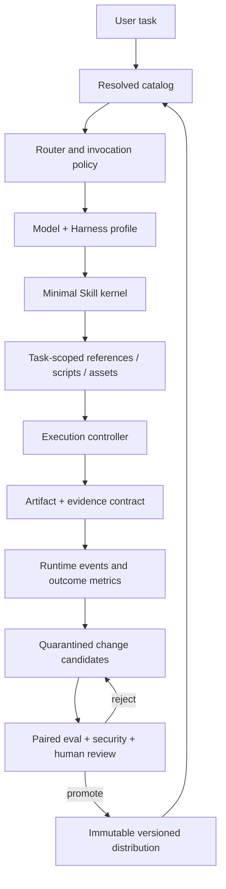

# Agent Skills Enter the Harness Era

## Prodcraft 2026 Competitive Landscape and Evolution Recommendations

> Research snapshot: 2026-08-28
>
> Prodcraft baseline: `fd05978dbbbf5a064205a695af47c8a550f1b224`
>
> Recommended decision: `TEST_FIRST`
>
> Research boundary: This report provides an evolution thesis, target architecture, and validation plan. It does not authorize a direct rewrite, release, or installation of third-party Skills.
>
> Historical snapshot retained during October 2 repository reconciliation. Subsequent implementation and bounded native evidence are recorded in the [September 11 acceptance](../reviews/2026-09-11-strict-host-closure.md) and [September 13 usability review](../reviews/2026-09-13-skill-usability.md). External research claims below were not comprehensively revalidated during that reconciliation and must not be treated as current host or repository state.

## 0. Executive Summary

### Core Thesis

Stronger models will not make Skills obsolete, but the unit of value has changed:

- **Skills 1.0** is a static manual that tells a model how to perform a task.
- **Skills 2.0** is an on-demand, composable, verifiable context package.
- **Skills 3.0** should be a versioned, evidence-backed capability package hosted by a Harness, including routing, permission requirements, runtime adapters, evaluations, artifact contracts, provenance, and an upgrade strategy.

For Prodcraft, the next cycle should not focus on adding more skills. It should answer four questions:

1. What can current models already do without a Skill?
2. Which Skills still deliver measurable marginal value on real tasks?
3. Which rules should move out of `SKILL.md` and into persistent instructions, workflows, hooks, subagents, or deterministic scripts?
4. For the same capability across Harnesses such as Codex, Claude Code, Gemini CLI, Copilot, and Cursor, is it merely "installable," or is it semantically equivalent and verifiable?

Current empirical research provides strong warnings:

- In controlled experiments on real software-engineering tasks in [SWE-Skills-Bench](https://arxiv.org/abs/2603.15401), 39 of 49 public Skills did not improve pass rates; the average lift was only `+1.2%`, and some Skills reduced performance because of version mismatch.
- In a [study of retrieval and use across 34k real Skills](https://arxiv.org/abs/2604.04323), gains continued to decline as the setup moved from forced loading to model selection, distractor inclusion, and large-catalog retrieval. Incorrect or weakly relevant Skills directly harmed outcomes.
- A study of [138,133 public `SKILL.md` files](https://arxiv.org/abs/2608.08453) found that `91.8%` had at least one reusability defect. The primary problems were not exotic advanced attacks, but weak routing metadata, bloated bodies, non-executable content, and poor resource organization.
- A [behavioral verification study](https://www.usenix.org/conference/usenixsecurity26/presentation/liu-yi) at USENIX Security 2026 confirmed 157 malicious samples among 98,380 Skills, demonstrating that third-party Skills are now an executable supply chain, not merely Markdown content.

This report therefore recommends:

> **Evolve Prodcraft from a "lifecycle Skills repository" into a "software-development capability control plane," but validate the thesis first through a small experiment with baselines, blind evaluation, and real Harnesses instead of immediately restructuring the entire repository.**

### Five Recommended Priorities

1. **Establish a model-relative marginal value gate**: every high-value Skill must demonstrate its net gain over a no-skill baseline, not merely prove that a task can pass when the Skill is present. After a model upgrade, first replay the archive and measure an identical-build noise floor; do not rewrite the corpus until drift clears a pre-registered bar.
2. **Establish an executable Harness capability matrix**: generate a versioned capability matrix from real CLI and host probes covering discovery, triggering, permissions, sandboxing, hooks, subagents, resource loading, and conflict resolution. Stop treating hand-written compatibility notes as current fact.
3. **Separate runtime primitives**: keep knowledge and low-risk, single-turn procedures in Skills; persistent boundaries in instructions or rules; deterministic processes with side effects, checkpoints, and human review in workflows or the Harness; isolated reasoning in subagents; and external tools in plugins or MCP.
4. **Turn publishing into a trusted supply chain**: require immutable artifacts, source SHAs, content digests, dependency inventories, permission requirements, static and semantic security scans, installation previews, and a resolved catalog.
5. **Put self-evolution in quarantine**: runtime experience may generate candidate revisions, but it must never write directly into a production Skill. Promotion must be explicit and follow repeated success, controlled evaluation, drift checks, and security review.

## 1. Research Route and Evidence Standard

### 1.1 Route

- Work type: `Spike / Research`
- Entry phase: `00-discovery`
- Depth: deep competitive and architectural research
- Decision: whether to enter the next cycle of Skills architecture upgrades, and what to validate first
- questions used: `0`
- questions remaining: `0`; the user's objective, research boundary, and deliverable format were sufficiently clear
- independence: the research process was `L1`: multiple isolated subtasks used the same model family to investigate different evidence slices independently, followed by cross-verification in the main research stream. External papers provide `L3` empirical evidence within their respective experimental scopes, but this report is not itself a third-party audit

### 1.2 Evidence Levels

This report prioritizes evidence in the following order:

1. the current local repository, machine validation, and actual installation surface;
2. official specifications, official product documentation, and official source code;
3. original research papers with explicit experimental designs;
4. current source, tests, and CI from competing repositories;
5. adoption signals such as GitHub stars, forks, and recent pushes;
6. community posts and secondary summaries, used only to discover candidates and never to support technical conclusions.

All GitHub metrics are snapshots from 2026-08-28. They will change, and they indicate attention rather than quality, security, or success on real tasks.

### 1.3 Scope

Covered:

- the Agent Skills open specification and the current official implementation directions of OpenAI, Anthropic, GitHub, Google, Cursor, and Microsoft/VS Code;
- leading or mechanism-representative repositories including Superpowers, gstack, Compound Engineering, wshobson/agents, ECC, Anthropic Skills, Vercel Skills, the Matt Pocock `grill-me` family, GitHub Awesome Copilot, JetBrains Skills, and antfu/skills;
- triggering, progressive disclosure, context cost, evaluation, cross-Harness adaptation, permissions, security, distribution, runtime observability, and self-evolution;
- Prodcraft's current architecture, evidence surface, installation surface, and primary gaps.

Not covered:

- security scanning of all community Skills;
- installation and execution of Prodcraft across every external Harness;
- independent reproduction of ROI claims reported by community repository authors;
- implementation, migration, release, or version commitments in this cycle.

## 2. Prodcraft's Current Truth Surface

### 2.1 Quantitative Baseline

| Dimension | Current fact | Interpretation |
| --- | ---: | --- |
| Authored skills | 46 | Covers nine lifecycle phases plus cross-cutting capabilities |
| Manifest maturity | 6 production / 32 tested / 8 review | All 46 use routed evaluation mode |
| Curated surface | 40 | 39 authored skills plus the generated `pc-prodcraft` |
| Public registry | 7 core / 33 beta | All 40/40 are `stability=beta` and `portable_with_caveat` |
| Tests | 73 test files / 466 tests | Full suite passed in this turn's host environment |
| Eval surface | 46/46 have mirrored eval directories | 796 tracked eval files; depth of coverage varies |
| Authored description | 79-304 chars | None exceeds the repository's 350-character cap or the standard's 1,024-character cap |
| Local Markdown references | authored 139 / curated 121 | Static checks found zero dangling references in both surfaces |
| Managed install | 40 packages / 0 load errors | Current installation index is pinned to the same HEAD, with matching core hashes |
| Always-on descriptions | 10,330 chars | Repository estimate: approximately 2,718 tokens; not provider-exact usage |
| Entry stack | 36,720 chars | Repository estimate: approximately 9,663 tokens; not provider-exact usage |
| Most recent commit | 2026-07-16 | No newer commit exists on local `main` |

Evidence entry points include [manifest.yml](../../manifest.yml), the [public skill registry](../../schemas/distribution/public-skill-registry.json), the [validator](../../scripts/validate_prodcraft.py), the [QA contract](../../skills/_quality-assurance.md), and the [runtime feedback loop](../observability/runtime-feedback-loop.md).

### 2.2 Established Advantages

Prodcraft is not an ordinary prompt or Skill collection. Its most valuable current assets are:

1. **The lifecycle and artifact flow form an explicit system**: phases, gates, iterative feedback edges, and upstream and downstream artifacts do not depend on a model's transient memory.
2. **Machine checks enforce consistency across authoring, manifest, evidence, public registry, and curated surfaces**: the repository already governs its factual surfaces, not merely its documentation style.
3. **The completion truth surface is comparatively advanced**: mechanisms such as work snapshots, evidence freshness, external route and completion pins, and the separation of machine and judge verdicts are already represented in schemas, code, and tests.
4. **Release claims are comparatively honest**: public packages retain `beta` status and portability caveats rather than presenting local green checks as maturity on every Host.
5. **Context cost is measurable**: the repository already has a static budget meter and monthly and quarterly feedback design, creating a foundation for a "subtract first" evolution cycle.

These capabilities are Prodcraft's moat and should not be discarded while pursuing newer frameworks. The next cycle should preserve the governance kernel while upgrading the runtime and evidence model.

### 2.3 Primary Gaps

| Gap | Current evidence | Impact |
| --- | --- | --- |
| Model/Harness freshness | The Anthropic trigger harness is a vendored snapshot from 2026-03-19; current results rely more heavily on a Codex surrogate | Old Host behavior cannot be treated as current fact |
| No automated multi-model regression matrix | Monthly task summaries exist in JSONL but do not proactively rerun major model-Harness pairs | Skill no-ops, negative lift, and routing drift after model upgrades cannot be detected promptly |
| Asymmetric Host enforcement | Only Claude has a repository hook on `Edit\|Write`; Codex and Gemini still rely primarily on prose gates | The same Skill has different risk boundaries across Hosts |
| Insufficient evidence of causal utility | In some benchmarks, both baseline and with-skill achieve perfect scores | Stability does not prove marginal Skill value |
| Public maturity remains mostly beta | All 40/40 are beta with caveats | No quantitative cross-Host promotion contract exists |
| High absolute context cost | 46 descriptions consume approximately 2,718 estimated tokens; the entry stack consumes approximately 9,663 | As models improve, duplicated instruction costs become more expensive |
| Uneven QA coverage | A few Skills have only one eval strategy | Maturity labels and the depth of supporting evidence are not fully isomorphic |
| Local dependencies are not fully pinned | Default Python lacks `PyYAML`; README and CI install dependencies on demand | Reproducibility of the validation tooling itself can improve |

For concrete evidence on freshness and enforcement, see the [vendored trigger harness](../../tools/anthropic_trigger_eval/VENDORED_FROM.md), [follow-up acceptance](../plans/2026-07-16-fable-followup-acceptance.md), and the [Claude PreToolUse adapter](2026-07-16-claude-pretooluse-adapter.md).

## 3. What Has Changed Externally

### 3.1 The Format Has Converged; Runtime Semantics Have Not

The [Agent Skills specification](https://agentskills.io/specification) has become a common cross-vendor packaging foundation: `SKILL.md`, `scripts/`, `references/`, `assets/`, and progressive disclosure. OpenAI, Anthropic, GitHub Copilot, Gemini CLI, Cursor, and VS Code/Microsoft Agent Framework now support or interoperate with this form.

The Host still determines the differences that matter:

- discovery directories, precedence, and same-name conflict handling;
- whether descriptions are shortened or omitted from the initial list;
- automatic triggering, explicit invocation, and path scoping;
- whether `allowed-tools` is recognized, applies for only one turn, or is ignored;
- whether a sandbox is enabled by default and which tools it covers;
- the semantics of hooks, workflows, subagents, MCP, and telemetry;
- whether the runtime can load resources, execute scripts, and access the network;
- installation, versioning, provenance, and update mechanisms.

The open specification is therefore a **portability floor**, not a complete runtime contract.

### 3.2 `description` Is Now a Probabilistic Routing API

The standard requires only `name` and `description`, but every Host uses them to decide whether to load the body. [OpenAI's current documentation](https://learn.chatgpt.com/docs/build-skills) explicitly limits the initial skill list to `2%` of the model's context window, or 8,000 characters when the window is unknown. When many skills are present, the Host first shortens descriptions and then omits some skills. The documentation frames that 8,000-character budget as catalog-only and describes the selected body as loaded; this must not be read as a guarantee that every selected-body byte is model-visible on every runtime path, because the current Codex extension adds a separate injection bound described in Section 5.3.

This makes the description a classification interface that requires independent testing:

- should-trigger recall;
- should-not-trigger precision;
- competition with adjacent Skills;
- robustness after description shortening;
- visibility in a large catalog;
- variance across model-Harness pairs.

### 3.3 Models Are Absorbing General Methodology; Harnesses Are Absorbing Execution Control

The first principle in OpenAI's current built-in [skill-creator](https://github.com/openai/codex/blob/main/codex-rs/skills/src/assets/samples/skill-creator/SKILL.md) is now to assume that Codex is already capable. It retains only non-obvious information that changes decisions, improves outcomes, or constrains real risk, while deleting generic advice, repetitive instructions, speculative boundaries, and examples that add no explanatory value.

At the same time, the [2026 evolution of the OpenAI Agents SDK](https://openai.com/index/the-next-evolution-of-the-agents-sdk/) integrates memory, sandbox-aware orchestration, the filesystem, MCP, skills, AGENTS.md, shell, and patching into a more complete Harness. Microsoft likewise treats Skills as context providers and explicitly distinguishes Skills from workflows, approvals, and script execution.

The direction is clear:

- models handle an increasing share of general reasoning;
- Harnesses handle an increasing share of state, permissions, isolation, scheduling, and recovery;
- Skills should contract around non-obvious knowledge, task contracts, reusable resources, and risk invariants.

### 3.4 The Ecosystem Has Exploded, but Scale Is Not Quality

[GitSkills](https://arxiv.org/abs/2608.10906) collected 3,797,117 `SKILL.md` files from 282,200 public repositories in July 2026, but only 1,877,981 had distinct content. Copying, projection, aggregation, and duplication have become normal.

Combined with the 91.8% defect rate and low average lift on real SWE tasks, the competitive question is no longer "Who has more Skills?" It is:

> Who can prove that a Skill is worth loading, trusting, and maintaining for a specific model, Harness, task, and version?

## 4. Competitive Landscape: Five Layers, Not One Ranking

Putting every repository into a single leaderboard by Skill count creates a false comparison. The current ecosystem has at least five layers:

| Layer | Problem addressed | Representatives |
| --- | --- | --- |
| Format and compatibility foundation | How a Skill is expressed and discovered | Agent Skills and vendor loaders |
| Content and methodology | What procedural knowledge to give the model | Superpowers, Matt Pocock `grill-me`, Vercel Agent Skills |
| Orchestration and Harness | How state, tools, permissions, subagents, and workflows execute | gstack, Compound Engineering, ECC, wshobson/agents, OpenAI, Claude, Cursor |
| Evaluation and evolution | Whether a Skill triggers, adds value, and should evolve | Anthropic skill-creator, Compound `ce-retune`, PluginEval, SkillsBench |
| Distribution and trust | How to install, pin, trace, audit, and roll back | GitHub `gh skill`, Vercel skills, JetBrains catalog, plugins |

### 4.1 Candidate Overview

| System | Adoption signal on 2026-08-28 | Most valuable lessons | What not to copy |
| --- | ---: | --- | --- |
| [Superpowers](https://github.com/obra/superpowers) | ~278.7k stars | A small, strong, composable methodology; brainstorm -> plan -> worktree -> TDD -> review; cross-Host bootstrap | Mandatory process can constrain strong models; compaction and hook support are not equivalent across Hosts |
| [ECC](https://github.com/affaan-m/ECC) | ~243.8k | memory -> instinct -> skill; low-context profiles; security scanning and recovery boundaries | The complexity and trust surface of 286 primary Skills, 68 agents, and 94 shims are enormous |
| [Matt Pocock `grill-me` family](https://github.com/mattpocock/skills) | ~239.3k | A dependency-aware decision frontier; explicit separation of agent-owned facts from human-owned decisions; stateless and repository-backed variants | Behavioral QA is light; completeness depends on the model discovering the full decision tree; the repository-backed variant writes durable artifacts during clarification |
| [Anthropic Skills](https://github.com/anthropics/skills) | ~172.1k | with/without baselines, blind A/B, held-out trigger optimization, and a human-review viewer | README explicitly labels some content as demonstration-only; tooling still has public issues; different Claude surfaces do not synchronize |
| [gstack](https://github.com/garrytan/gstack) | ~130.1k | A runtime-first software factory; real browsers and devices; behavioral profiles; isolated self-evolution | Claude-first, strongly opinionated, and dependency- and maintenance-heavy; some ROI claims are author-reported |
| [wshobson/agents](https://github.com/wshobson/agents) | ~39.2k | One source with multiple adapters, a capability-loss matrix, real CLI smoke tests, and statistical evaluation | Custom scoring still lacks independent validation; compatibility facts can still drift |
| [GitHub Awesome Copilot](https://github.com/github/awesome-copilot) | ~38.3k | Plugin manifests, SemVer, automated marketplace publishing, and contribution and validation pipelines | Strong aggregation surface, uneven proof of behavioral utility |
| [Vercel Agent Skills](https://github.com/vercel-labs/agent-skills) | ~30.6k | High-value domain knowledge, deterministic scripts, immutable releases, and a digest-based discovery index | Repository-wide behavioral evaluation is weaker than Anthropic's; some skills depend on live web content |
| [Agent Skills](https://github.com/agentskills/agentskills) | ~24.8k | A common format, progressive disclosure, and a reference validator | Deliberately does not specify activation, permissions, versions, or evaluation |
| [Compound Engineering](https://github.com/EveryInc/compound-engineering-plugin) | ~24.6k | A six-stage development loop; verified capture and refresh of solved problems; measurement-gated model retuning; cross-Host evaluation cells | A 33-Skill, 14-Host surface widens potential maintenance, compatibility, and trust costs; behavioral cells are opt-in and incomplete; cross-model review may expand data egress |
| [antfu/skills](https://github.com/antfu/skills) | ~5.8k | Generation from official documentation, submodules and source freshness, and an honest distinction between always-on instructions and Skills | The author positions it as a proof of concept; overall QA is relatively light |
| [JetBrains Skills](https://github.com/JetBrains/skills) | ~0.3k | Curated aggregation, `metadata.source`, and a changed-skill security gate | The depth of "verified" status and actual adoption remain limited; upstream risk is inherited |

### 4.2 Top Eight to Track

This order reflects learning value for Prodcraft's next phase, not star count:

1. **Anthropic skill-creator**: learn causal A/B testing, clean contexts, variance analysis, blind evaluation, and held-out trigger tuning.
2. **gstack**: learn runtime truthfulness, Harness capabilities, token BOMs, candidate-knowledge quarantine, and contact with real environments.
3. **Compound Engineering**: learn verified knowledge capture and refresh, model-retuning noise floors, pre-registered promotion bars, adversarial corpus review, and cross-Host A/B cells.
4. **wshobson/agents**: learn canonical-source multi-Host adapters, capability degradation, generated-artifact drift management, and CLI smoke testing.
5. **Matt Pocock `grill-me` family**: learn how a compact Skill can compile ambiguous requirements into a dependency graph while preserving the boundary between discoverable facts and owner decisions.
6. **Superpowers**: learn how to decompose a methodology into a small number of composable behavioral modules instead of a monolithic process.
7. **GitHub + Vercel distribution systems**: learn `@TAG/@SHA`, tree SHAs, immutable artifacts, digests, installation previews, and publish-time security checks.
8. **ECC**: learn persistent memory, self-evolution, and large-scale security, while treating it as an upper-bound warning on complexity.

The Agent Skills specification remains the foundation, but it should not be mistaken for a complete competitor or evidence of maturity.

## 5. Detailed Analysis of Key Competitive Mechanisms

### 5.1 Anthropic: A Skill Should Be Treated as Experimental Software

The value of Anthropic's official `skill-creator` lies not in its template, but in its feedback loop:

1. run both with-skill and baseline for every real prompt;
2. execute in a clean context to avoid contamination from the author's context;
3. score verifiable assertions, artifacts, and evidence;
4. record pass rate, time, tokens, and variance;
5. let humans compare actual outputs through a viewer;
6. run blind A/B comparisons between two versions when needed;
7. evaluate trigger descriptions with should-trigger and should-not-trigger prompts, repeated samples, and a train/held-out split, then select the description based on held-out results.

This approach directly targets Prodcraft's most important current gap: **much of the existing evidence proves that Skills can run, but does not consistently prove that they outperform no Skill.**

Lessons to adopt, with extensions:

- executors and judges from the same provider may share biases;
- synthetic prompts cannot replace real repositories and real tasks;
- description optimization must account for catalog competition;
- beyond pass rate, evaluations should measure avoidance of critical risk and truth-surface accuracy.

### 5.2 gstack: Competition Has Shifted from Prompts to Runtime

gstack connects Think -> Plan -> Build -> Review -> Test -> Ship -> Reflect into a factory with real tools and artifacts. Current source shows that it addresses:

- behavioral profiles after model changes;
- verify gates and external second opinions;
- freezes on destructive commands;
- token and context BOMs;
- prompt injection and remote trust policies;
- browsers, devices, QA, benchmarking, and security;
- generation of scripts, tests, and fixtures from successful trajectories;
- quarantine of newly generated knowledge, with promotion only after repeated success.

The key lesson for Prodcraft is that experience must become external state and replayable evidence, not that Prodcraft should copy more than 20 specialists or an entire Claude-first UX.

### 5.3 wshobson/agents: The Adapter Architecture Is Sound, but Compatibility Documentation Still Expires

wshobson/agents generates Codex, Cursor, OpenCode, Copilot, and Antigravity projections from one canonical source and maintains:

- `capabilities.py` as the generating source for the capability matrix;
- mechanical conversion of frontmatter, model aliases, tool names, agents, and commands;
- checks for dead links, stale artifacts, name collisions, and size;
- real CLI smoke tests;
- PluginEval with static checks, an LLM judge, and Monte Carlo evaluation;
- approval and exact-SHA pinning for external plugins.

This is one of Prodcraft's closest architectural competitors, but the current research found that both the competitor's blanket wording and the previous version of this report's blanket contradiction were too broad. There are at least two distinct Codex budgets and more than one loading path:

- [OpenAI's user documentation](https://learn.chatgpt.com/docs/build-skills) describes a `2%` or 8,000-character budget for the initial catalog metadata, followed by loading the selected body;
- the current [Codex Skills extension source](https://github.com/openai/codex/blob/main/codex-rs/ext/skills/src/extension.rs) separately calls `truncate_main_prompt_contents` on selected Skill content and emits a truncation warning;
- [OpenAI issue #37463](https://github.com/openai/codex/issues/37463), which remains open, reports a source-path asymmetry: the Agent Plugin and extension paths apply `MAX_SKILL_PROMPT_BYTES`, while some legacy host, repository, user, and system paths can remain unbounded;
- Compound Engineering's [executable prompt-budget ratchet](https://github.com/EveryInc/compound-engineering-plugin/blob/84bdf8c5a19f166b6c1d787254e96dd12931c9a7/tests/codex-skill-prompt-budget.test.ts) therefore tracks an 8,000-byte Agent Plugin injection boundary separately from the catalog-character budget.

The boundary is path- and version-specific, and truncation can be recoverable when the model retains a file path and reads the remainder. The corrected lesson is stronger than either blanket claim:

> **Compatibility facts must name the source class, runtime path, Host version, probe time, and recovery behavior. Documentation, code, and real probes are complementary evidence, not interchangeable truth.**

### 5.4 Matt Pocock `grill-me`: Clarification as a Dependency Graph

At researched commit [`6654f6b`](https://github.com/mattpocock/skills/commit/6654f6b60cd9d5be8b54c6fafe44346dabeb3b76), the current upstream family is more sophisticated than its tiny wrapper suggests:

- [`grill-me`](https://github.com/mattpocock/skills/blob/6654f6b60cd9d5be8b54c6fafe44346dabeb3b76/skills/productivity/grill-me/SKILL.md) is an explicit, user-invoked shell that delegates to the reusable [`grilling`](https://github.com/mattpocock/skills/blob/6654f6b60cd9d5be8b54c6fafe44346dabeb3b76/skills/productivity/grilling/SKILL.md) primitive;
- `grilling` models the design as a tree and asks the entire **frontier** of decisions whose prerequisites are settled, while deferring dependent questions to later rounds;
- facts that can be discovered from the environment belong to the agent and may be investigated concurrently; choices belong to the user and must not be silently inferred;
- the Skill does not authorize implementation when the frontier is empty; it requires the user to confirm shared understanding first;
- [`grill-with-docs`](https://github.com/mattpocock/skills/blob/6654f6b60cd9d5be8b54c6fafe44346dabeb3b76/skills/engineering/grill-with-docs/SKILL.md) composes the interrogation with [`domain-modeling`](https://github.com/mattpocock/skills/blob/6654f6b60cd9d5be8b54c6fafe44346dabeb3b76/skills/engineering/domain-modeling/SKILL.md), lazily persisting a glossary in `CONTEXT.md` and only recording ADRs for hard-to-reverse, surprising decisions with a real trade-off.

This produces three high-value design ideas for Prodcraft:

1. distinguish a user-invoked UX shell from a model-invoked reasoning primitive;
2. replace an undifferentiated question queue with a dependency-aware frontier, so independent questions and fact-finding can proceed without serial latency;
3. offer stateless clarification and a separately authorized repository-backed mode, instead of letting durable writes emerge implicitly.

A static pass over the researched commit found 37 `SKILL.md` files; all 37 had non-empty, directory-matching names and descriptions of 34-417 characters, while all 27 repository-local Markdown references and both packaged-resource mentions resolved. Two additional non-resolving Markdown targets are explicit template/output examples rather than packaged dependencies. This is a clean static surface, but not a behavioral proof system. Public GitHub Checks expose only the successful `Version` release job, not a comparable trigger or task-outcome evaluation harness. A concise design-tree instruction also cannot prove that the model discovered every relevant branch, and `grill-with-docs` needs explicit dirty-tree and write-authority boundaries before Prodcraft should emulate it.

A read-only inspection of this machine also found a concrete local installation and dependency-closure failure: the installed `grilling` body still uses the [`v1.0.0` one-question-at-a-time protocol](https://raw.githubusercontent.com/mattpocock/skills/v1.0.0/skills/productivity/grilling/SKILL.md), while the current upstream uses frontier rounds, and the installed `grill-with-docs` entry references a `domain-modeling` Skill that is absent from the local Skill surface. The three installed entrypoints have structurally valid frontmatter names and descriptions, but the repository-backed dependency chain is not runtime-complete. This is direct evidence that frontmatter validity and entrypoint visibility do not prove dependency closure, freshness, or end-to-end loadability.

### 5.5 Compound Engineering: Institutional Learning with a Measurement Gate

At researched commit [`84bdf8c`](https://github.com/EveryInc/compound-engineering-plugin/commit/84bdf8c5a19f166b6c1d787254e96dd12931c9a7), [Compound Engineering](https://github.com/EveryInc/compound-engineering-plugin) connects brainstorm -> plan -> work -> simplify -> review -> compound across 33 Skills and 14 Agent Hosts. Its distinctive contribution is not the size of the workflow but the attempt to turn solved work into a maintained institutional asset:

- [`ce-compound`](https://github.com/EveryInc/compound-engineering-plugin/blob/84bdf8c5a19f166b6c1d787254e96dd12931c9a7/skills/ce-compound/SKILL.md) captures one verified, non-trivial solved problem per run into `solutions/`, with mechanical and semantic grounding checks;
- [`ce-compound-refresh`](https://github.com/EveryInc/compound-engineering-plugin/blob/84bdf8c5a19f166b6c1d787254e96dd12931c9a7/skills/ce-compound-refresh/SKILL.md) rechecks captured learning against current code and assigns exactly one outcome: Keep, Update, Consolidate, Replace, or Delete; current code remains the truth source for current mechanics, and version history remains the archive;
- [`ce-retune`](https://github.com/EveryInc/compound-engineering-plugin/blob/84bdf8c5a19f166b6c1d787254e96dd12931c9a7/skills/ce-retune/SKILL.md) refuses to retune a corpus without an archive or benchmark harness, a build selector, and a repeatable end-to-end task. It measures identical-versus-identical noise, pre-registers the promotion bar, separates independent proposer and defender contexts, changes the corpus surgically, and discloses unmeasured phases;
- its [phase-loaded kernel](https://github.com/EveryInc/compound-engineering-plugin/blob/84bdf8c5a19f166b6c1d787254e96dd12931c9a7/CONCEPTS.md) keeps outcomes, completion criteria, authority, phase order, and stop classes early, then loads detailed references at the action point rather than paying the entire context cost up front;
- [cross-model review](https://github.com/EveryInc/compound-engineering-plugin/blob/84bdf8c5a19f166b6c1d787254e96dd12931c9a7/skills/ce-doc-review/references/cross-model-review.md) distinguishes the requested target, CLI intermediary, served model, independence, egress, and mutation authority instead of equating a command name with an independent reviewer;
- the repository's [skill-eval cell](https://github.com/EveryInc/compound-engineering-plugin/tree/84bdf8c5a19f166b6c1d787254e96dd12931c9a7/tests/skill-eval-cell) can run isolated A/B arms on installed Claude, Codex, and Grok CLIs, while CI also runs strict plugin validation and the full Bun test suite.

At the exact researched commit, the public `test`, `windows-native`, `release-pr`, `build`, `report-build-status`, and `deploy` checks all completed successfully. This is stronger runtime-package evidence than a README claim, although it still does not independently reproduce all fourteen Hosts or the optional behavioral cells.

The same static pass found 33 `SKILL.md` files; all 33 had non-empty, directory-matching names and descriptions of 53-535 characters, and all 222 packaged-resource mentions resolved. Together with strict manifest validation and the passing public CI, this supports structural loadability at the researched revision. It does not establish semantic equivalence across all Hosts.

This is the competitor that most directly answers the user's first question: when a model changes, do not rewrite the corpus by intuition. First prove that behavior changed above the noise floor, then make attributable cuts until a pre-registered bar clears.

Prodcraft should adopt the measurement gate, phase-loaded kernel, and learning-freshness state machine, not the whole surface. Compound Engineering's behavioral cells are opt-in rather than a complete default matrix; its own documentation says full Skill coverage is not the goal. Capture, refresh, and retrieval are mechanized, but [promotion into an always-on rule, hook, test, or new Skill](https://github.com/EveryInc/compound-engineering-plugin/issues/866) still lacks a universal evidence gate. Thirty-three Skills across fourteen Hosts widen the potential maintenance, compatibility, and trust surface; actual context and compute costs were not measured. Cross-model review can also send repository content to another provider, and the [v3.23.4 GitHub release metadata](https://api.github.com/repos/EveryInc/compound-engineering-plugin/releases/tags/compound-engineering-v3.23.4) is not marked immutable. Author-reported productivity claims should therefore remain adoption context, not evidence of causal lift.

### 5.6 Superpowers: Strong Methods Become Composable Modules, Not a Monolith

Superpowers excels at decomposing methodology into a small number of clear, composable behavioral modules that can recover across sessions. Combined with the model-relative pruning rule in OpenAI's skill-creator, its direct implication for Prodcraft is that lifecycle completeness does not mean every phase should have an equally substantial Skill. Some capabilities may need to collapse into:

- a short router;
- an artifact schema;
- a deterministic verifier;
- or the model's default capability, retaining only organization-specific constraints.

### 5.7 GitHub, Vercel, and JetBrains: The Distribution Layer Is Developing a Trust Threshold

GitHub's current `gh skill` documentation supports search, preview, install, update, publish, `@TAG/@SHA`, and `--pin`, and records the source ref and tree SHA. Publish dry runs check specification compliance, tag protection, secret scanning, and code scanning.

Vercel Agent Skills publishes an immutable GitHub release when `main` changes, generating an independent artifact, SHA-256 digest, and discovery index for each Skill. The JetBrains catalog preserves exact `metadata.source` for aggregated content, runs Cisco skill-scanner on changed skills, and blocks a PR only for newly introduced error-level findings.

Together, these mechanisms show that next-generation Skill distribution requires at least:

- immutable versions;
- exact source provenance;
- content digests;
- previews before installation;
- dependency and capability declarations;
- changed-surface security gates;
- recoverable update and removal semantics.

## 6. As Models Evolve: What to Keep, Move, and Delete

### 6.1 Decision Criteria

Every piece of Skill content should answer:

1. Does it still change the current model's decision or outcome?
2. Is it organization-, repository-, or tool-specific information that model training cannot reliably know?
3. Does it protect a safety, permission, or truth invariant that ordinary reasoning cannot replace?
4. Should deterministic code, a schema, or Host policy enforce it instead of a natural-language reminder?
5. Is its loading cost and false-trigger risk lower than its benefit?

### 6.2 Content Migration Matrix

| Current content type | Future default location | Rationale |
| --- | --- | --- |
| General programming knowledge and generic best practices | Delete, or retain only the minimum prompt shown necessary by evaluation failures | Strong models have absorbed it; it is the most likely source of no-op tokens |
| Organization-level boundaries, delivery truth, permissions, and risk invariants | Skill kernel or always-on policy, depending on whether they apply to every turn | These are institutional facts the model cannot infer |
| Detailed framework, API, and version knowledge | Traceable references or live retrieval from official sources | Requires freshness and on-demand loading |
| Repetitive, deterministic transformations, validation, and packaging | Scripts and tools | Natural-language reimplementation is unstable and wastes context |
| Processes with side effects, checkpoints, approvals, compensation, and rollback | Workflow or Harness controller | Skill text is neither an authorization system nor a transaction system |
| Independent multi-role analysis and long-context isolation | Subagent | Prevents confirmation bias and context contamination |
| Global team conventions and simple rules that always apply | `AGENTS.md`, rules, or Host policy | Avoids false negatives from automatic triggering |
| External-system capabilities and credential boundaries | Plugin/MCP plus Host permissions | Tool capabilities should not masquerade as plain-text knowledge |
| When to use a Skill | Frontmatter description plus trigger evaluation | The body loads only after triggering |
| Compatibility claims | Executable probes plus versioned evidence | Hand-written matrices drift |

### 6.3 Where Skills Remain Most Valuable

- company- or repository-specific processes, schemas, truth, and terminology;
- tools and APIs introduced after the current model's training cutoff or that change frequently;
- complex but reusable procedural knowledge;
- work requiring specific artifact contracts, verification standards, and handoff boundaries;
- specialized capabilities absent from smaller or lower-cost models;
- domain context that should load on demand rather than remain persistent;
- prompts and resources that testing proves can materially increase success or prevent critical failure.

## 7. Proposed Target: Prodcraft Capability Control Plane

### 7.1 Target Architecture

### 7.2 Seven Logical Layers

#### Layer 1 - Skill Kernel

Retain only the cross-Host-stable core that changes behavior:

- task contract;
- input and output artifacts;
- non-obvious domain facts;
- critical risks and stop conditions;
- routing to the required reference or verifier.

The Kernel should not repeat approvals, sandbox controls, or general programming habits that the Host already enforces reliably.

#### Layer 2 - Capability Manifest

Structure the runtime requirements currently scattered across prose:

- required and optional tools;
- invocation ownership (`human`, `model`, or both), transitive Skill dependencies, write effects, and confirmation gates;
- capabilities such as network, filesystem, secrets, subagents, browsers, and GUI;
- side-effect class and approval requirements;
- supported and unsupported execution modes;
- dependencies, versions, and provenance;
- output artifacts and verifier contracts.

The Manifest declares requirements; it does not grant permissions. Host policy must interpret it conservatively.

#### Layer 3 - Harness Adapter

One canonical source generates or resolves into each Host's native form, but every adapter must record:

- semantics preserved;
- semantics degraded;
- semantics that cannot be expressed;
- Host- and version-specific workarounds;
- the corresponding executable probe and most recent passing time.

#### Layer 4 - Model/Harness Eval Profile

Maturity is no longer a single label on a Skill. It is:

`skill version × model version × harness version × task cohort × evaluation date`

At minimum, it contains:

- paired results for no-skill, current, and candidate;
- routing precision, recall, and F1;
- task pass rate, critical violations, tokens, time, cost, and variance;
- independence of judges and providers;
- distinction between exact and estimated usage;
- evidence expiration.

#### Layer 5 - Runtime Controller

At execution time, it handles:

- catalog resolution and collision diagnostics;
- task-scoped context compilation;
- permission preflight;
- workflow checkpoints and durable state;
- artifact validation;
- failure classification and recovery;
- telemetry redaction.

This layer belongs in the Harness or CLI, not in every `SKILL.md`.

#### Layer 6 - Trusted Distribution

Every release should produce:

- an immutable artifact;
- exact source SHA and tree SHA;
- a content digest;
- a dependency and capability inventory;
- transitive dependency-closure and actual-load probes;
- validator, security, reference, and loadability results;
- compatibility and evidence profiles;
- ownership for upgrades, rollback, and removal.

#### Layer 7 - Governed Evolution

Runtime observations may generate candidates, but the flow must be:

`observation -> candidate -> quarantine -> paired eval -> adversarial review -> promotion/rejection`

Captured institutional learning should also carry explicit freshness states and evidence-backed transitions such as:

`grounded -> fresh -> stale -> updated / consolidated / replaced / deleted`

Current code and replayable behavior are authoritative for current mechanics; version history is the archive. Any design that writes back automatically, promotes directly to production, or treats model self-evaluation as final evidence should fail closed.

## 8. Gap Between Prodcraft and the Target Architecture

| Capability | Current state | Target | Priority |
| --- | --- | --- | --- |
| Lifecycle, artifact flow, and gate semantics | Strong | Preserve as the kernel's core differentiation | Preserve |
| Static consistency across frontmatter, references, curated, and public surfaces | Strong | Retain as a baseline pre-release gate | Preserve |
| Static measurement of context cost | Moderately strong | Upgrade to model-relative marginal value | P0 |
| Trigger behavior evaluation | Historical harness and partial evidence exist | Multi-model, held-out, catalog competition, and versioned | P0 |
| With/without causal utility | Uneven; baseline and with-skill tie in some cohorts | Paired cohorts for every critical Skill | P0 |
| Multi-Host capability truth | Policies and caveats exist, but freshness is insufficient | Executable probes and exact Host versions | P0 |
| Runtime enforcement | Partial Claude hook; asymmetric on other Hosts | Host-native controller with fail-closed degradation | P1 |
| Separation of workflow, subagent, and Skill primitives | Still overlaps | Clear classification and compiler routing | P1 |
| Distribution provenance | Hash and evidence binding plus curated truth exist | Immutable artifacts, source and tree SHAs, dependency and capability inventories | P1 |
| Supply-chain security | Security review exists but is not a unified install and release gate | Natural language, code, dependency, and provenance scanner | P1 |
| Runtime telemetry | JSONL schema and review mechanism exist | Cross-Host skill event schema with privacy-preserving defaults | P2 |
| Dependency-aware clarification | Intake and problem framing exist, but questions are not modeled as a decision frontier | Separate environment facts from owner decisions and expose only prerequisite-satisfied questions | P1 |
| Institutional learning freshness | Runtime feedback exists, but no durable store has an explicit keep/update/consolidate/replace/delete lifecycle | Evidence-grounded learning store with discoverability and drift checks | P2 |
| Self-evolution | Feedback loop exists; formal runtime quarantine and promotion do not | Isolated candidates, repeated success, and human promotion | P3 |

## 9. Three Strategic Propositions

### Proposition A: Continue Hardening the Current Repository

Approach: refresh the vendored harness, expand evaluations, and fix dependencies and documentation without changing the overall architecture.

- Advantage: low cost and risk; can restore freshness quickly.
- Disadvantage: continues tying maturity to the static Skill itself and cannot resolve model no-ops, Host semantics, or runtime boundaries.
- Fit: a short-term maintenance window.
- Conclusion: viable as Phase 0, but insufficient as the next strategic direction.

### Proposition B: Thin Skills, Delegate as Much as Possible to the Model

Approach: substantially reduce Skills, retaining only a small number of routers, schemas, and verifiers.

- Advantage: lowest context cost and maintenance surface.
- Disadvantage: may discard Prodcraft's most valuable lifecycle, delivery-truth, and organizational-governance capabilities.
- Fit: generic methodology Skills with low risk and already-strong baselines.
- Conclusion: should emerge from per-Skill experiments, not serve as a repository-wide prior.

### Proposition C: Capability Control Plane

Approach: preserve the governance kernel and elevate Host adapters, evaluation, runtime control, distribution trust, and the evolution loop into first-class capabilities.

- Advantage: adapts to both model and Harness evolution while amplifying Prodcraft's existing truth-surface strengths.
- Disadvantage: without a Reality Wedge, it could become another large and complex Harness project.
- Fit: Prodcraft's medium- to long-term direction.
- Conclusion: **recommended, but strictly `TEST_FIRST`. Validate the smallest architectural slice first.**

## 10. Conflict Map

| ID | Claim A | Claim B | Impact | Resolution mechanism | Status |
| --- | --- | --- | --- | --- | --- |
| C-01 | Complete lifecycle guidance can improve reliability | Strong models may turn much of generic guidance into no-ops or interference | Determines the degree of pruning | `EXPERIMENT_NEEDED`: paired evaluation | OPEN |
| C-02 | One canonical Skill should be reusable across Hosts | Discovery, permissions, sandboxes, and hook semantics differ across Hosts | Determines the architecture boundary | `FACT_NEEDED`: versioned capability probes | OPEN |
| C-03 | Learning automatically from successful trajectories can accelerate evolution | Self-writeback amplifies injection, misattribution, and contamination | Determines self-evolution permissions | `OWNER_DECISION` plus quarantine experiment | RESOLVED: direct promotion is prohibited by default |
| C-04 | Scripts can improve determinism and reduce token use | Scripts expand the supply-chain and local-execution risk surface | Determines the scope of script use | `FACT_NEEDED`: capability, provenance, and security gate | OPEN |
| C-05 | Stars and installation counts can identify popular capabilities | Real SWE lift and security do not correlate with popularity | Determines competitor adoption criteria | `FACT_NEEDED`: source and behavioral evidence | RESOLVED: stars are an adoption signal only |
| C-06 | Static validators and tests are already strong | They cannot prove causal lift on current models | Determines the definition of maturity | `EXPERIMENT_NEEDED`: model-Harness profile | OPEN |
| C-07 | Asking one question at a time minimizes cognitive load | Asking the full dependency-free frontier reduces serial latency and exposes parallel fact-finding | Determines the clarification UX | `EXPERIMENT_NEEDED`: compare rounds, unanswered branches, correction rate, and user burden | OPEN |

## 11. Recommended Reality Wedge

### 11.1 Select Six Representative Skills

| Skill | Representative role | Core hypothesis |
| --- | --- | --- |
| `pc-intake` | gateway and always-on boundary | Structured intake reduces scope and authorization errors, but the body may be too heavy |
| `pc-systematic-debugging` | generic methodology | Strong models may already perform most of the root-cause loop by default |
| `pc-task-execution` | orchestration | Some responsibilities should move to workflow or Harness state |
| `pc-code-review` | strong model-native capability | Marginal value may be concentrated in the truth surface and risk classification |
| `pc-security-audit` | high risk | Worth retaining if it materially reduces critical misses, even without pass-rate lift |
| `pc-delivery-completion` | evidence and terminal truth | One of Prodcraft's core capabilities least likely to be absorbed by a general model |

### 11.2 Four Controlled Conditions

1. `BASELINE`: no Skill; provide only the task, repository, and normal Host instructions;
2. `CURRENT`: current Skill;
3. `KERNEL`: reduced to the task contract, non-obvious invariants, artifacts, and verifier;
4. `COMPILED`: a minimal capsule compiled dynamically for the task and Host, including required references and capabilities.

### 11.3 Models and Harnesses

Cover at least:

- Codex plus the current primary OpenAI coding model;
- Claude Code plus the current primary Claude model;
- Gemini CLI plus the current primary Gemini model.

At experiment start, pin the exact model ID, CLI or desktop version, configuration, sandbox, network, tools, and repository SHA. Do not use "latest" as a reproducible experimental identifier in the report.

### 11.4 Minimum Sample

Recommended first phase:

- four real, repository-grounded tasks per Skill;
- at least two independent runs per condition;
- three model-Harness pairs;
- `6 × 4 × 4 × 2 × 3 = 576` trajectories in total.

This is a reducible budget recommendation, not implementation authorization. If cost is prohibitive, begin with three Skills and two Hosts for a 192-run pilot, but do not remove the no-skill baseline or independent repeat.

### 11.5 Scoring Dimensions

- deterministic acceptance pass;
- artifact truth and evidence correctness;
- critical safety or permission violations;
- trigger precision, recall, and F1;
- total input and output tokens, time, tool calls, retries, and errors;
- human override and clarification burden;
- variance;
- Host capability degradation;
- independence of judges and executor providers.

### 11.6 Focused Clarification Protocol Experiment

Within the `pc-intake` and requirements cohorts, budget a smaller protocol comparison separately rather than folding it into the 576-trajectory core estimate:

1. `SINGLE`: the v1.0.0 one-question-at-a-time protocol;
2. `FRONTIER`: the current upstream dependency-frontier protocol;
3. `PRODCRAFT_BOUNDED`: separate fact and decision lanes, use a risk-bounded frontier, require an artifact gate, and forbid implementation before explicit confirmation.

Measure decision coverage, false assumptions, questions the agent could have answered itself, user rounds, repeated questions, anchoring from recommended answers, unauthorized writes or early implementation, and successful transitive dependency loading. The goal is to test the mechanism, not to import the upstream Skill verbatim.

## 12. Falsification Experiment

| Field | Content |
| --- | --- |
| Assumption | `A-01`: Retaining the governance kernel while moving Host and runtime semantics into the control plane can reduce context cost and improve cross-Host reliability without sacrificing critical risk controls |
| Subjects | The six Skills above, 24 real tasks, and three model-Harness pairs |
| Method | Paired evaluation across BASELINE, CURRENT, KERNEL, and COMPILED, with independent repeats, deterministic verifiers, blind evaluation, and capability probes |
| Cost | 576 trajectories plus evaluator and infrastructure time; token, concurrency, and external-service budgets should be estimated separately before execution |
| Window | Recommended 4-6 weeks for pilot execution, review, and architecture decision |
| Success | `KERNEL` or `COMPILED` does not underperform CURRENT on verified success across most cohorts; materially reduces persistent or loaded context; does not increase critical misses for high-risk Skills; and produces a repeatable capability profile for at least two Hosts |
| Failure | BASELINE and candidates remain indistinguishable, candidates increase critical misses, Host adapters require extensive manual forks, or runtime cost exceeds the benefit |
| Continue | Enter bounded requirements and system design, then expand to the remaining high-value Skills |
| Stop | Stop expanding the Control Plane and return to selective pruning plus hardening of current governance |
| Owner | Repository maintainer, pending explicit user assignment; this report does not assume implementation ownership |

### Proposed Quantitative Promotion Gates

The following thresholds are initial policies to validate, not established industry standards:

- ordinary Skill: at least `+5 percentage points` verified pass lift over BASELINE, or materially lower cost or variance at the same success rate;
- high-risk Skill: pass-rate lift is optional, but critical violations must decrease materially and no new authorization overreach may be introduced;
- trigger: precision and recall both reach `0.90` and pass competition tests against adjacent Skills and a long catalog;
- context: candidate reduces loaded characters or measured tokens by at least `25%` relative to CURRENT, unless equivalent cost can be shown to buy critical risk reduction;
- portability: every claimed Host has a pinned version, resolved catalog, and recent probe;
- evidence: when a model-Harness profile exceeds the defined freshness window, it automatically degrades and no longer supports a maturity conclusion.

## 13. Measurement System

### 13.1 North Star

Do not use Skill count, documentation length, or installation count as the primary metric. Use:

> **Verified Net Task Value per Context Cost**

as a directional North Star. It is not a context-free composite score; it presents these dimensions together:

- `Δ verified success`;
- `Δ critical failure`;
- `routing quality`;
- `context/runtime cost`;
- `variance`;
- `freshness`.

### 13.2 Required Reports

1. Skill x model x Harness heatmap;
2. with-skill versus no-skill marginal lift;
3. trigger confusion matrix;
4. context, token, and time BOM;
5. capability-loss matrix;
6. evidence age and next revalidation;
7. candidate promotion and rejection history;
8. learning freshness, contradiction, and retrieval-discoverability status;
9. supply-chain inventory and scan results.

### 13.3 Proposed Maturity Semantics

Retain authored maturity, but add profile-level verdicts:

- `STRUCTURALLY_VALID`
- `LOADABLE_ON_<HOST_VERSION>`
- `ROUTING_EVALUATED`
- `CAUSAL_LIFT_CONFIRMED`
- `RISK_REDUCTION_CONFIRMED`
- `PORTABLE_WITH_MEASURED_LOSS`
- `EVIDENCE_STALE`

Any top-level `production` conclusion should be aggregated from these profiles, not used to infer them.

## 14. Phased Roadmap

### P0 - Establish Truth Before Changing the Architecture

Recommended window: 1-2 weeks.

- pin validator and test dependencies to create a reproducible local command;
- update vendored harness provenance without treating the surrogate as official Host truth;
- establish a model, Harness, and version registry;
- write minimal read-only capability probes for Codex, Claude Code, and Gemini CLI;
- probe catalog metadata limits and selected-body injection limits separately for each source class and runtime path;
- capture the current descriptions, entry stack, references, and actual loader results as a baseline snapshot;
- select real repository tasks and deterministic verifiers for the Reality Wedge.

### P1 - Prove Which Skills Still Deserve to Exist

Recommended window: 2-4 weeks.

- run the six-Skill paired pilot;
- run held-out trigger evaluation on descriptions;
- compare one-question-at-a-time and dependency-frontier clarification on `pc-intake` and requirements tasks;
- produce CURRENT, KERNEL, and COMPILED candidates separately;
- classify each as delete, demote, keep, move-to-workflow, move-to-policy, or move-to-script;
- do not expand Skills that fail the causal gate.

### P2 - Build the Minimum Control Plane

Recommended window: 4-6 weeks, only after P1 succeeds.

- capability manifest schema;
- resolved catalog and collision diagnostics;
- canonical kernel to Host adapters;
- task-scoped context compiler;
- runtime skill event schema;
- a minimal evidence-grounded learning store with freshness and discoverability checks;
- immutable release with digest and provenance;
- Host semantic degradation report.

### P3 - Supply Chain and Governed Evolution

Recommended window: after P2 stabilizes.

- installation previews and dependency and permission inventories;
- security scanning of natural language, scripts, dependencies, and provenance;
- exact SHA and version pins plus rollback;
- candidate quarantine;
- promotion after repeated success;
- cross-provider judges or human review;
- automatic generation of pruning and revalidation proposals, but no automatic merge;
- model-retuning runs that first measure an identical-versus-identical noise floor and pre-register the promotion bar.

## 15. Explicit Non-Recommendations

- Do not measure improvement by the number of new Skills.
- Do not import a popular repository wholesale into Prodcraft.
- Do not equate specification compliance, a green validator, or installation success with behavioral maturity.
- Do not let one model or provider act as executor, judge, and final promotion authority.
- Do not keep disguising hooks, approvals, sandboxes, and side-effecting workflows as natural-language requirements.
- Do not maintain a static "fully supported" matrix without exact Host and version probes.
- Do not let runtime learning modify production Skills directly.
- Do not treat stars, forks, or marketplace installation counts as quality scores.
- Do not execute third-party Skill scripts without provenance and an installation preview.
- Do not delete all governance because models are stronger, and do not retain all old text because the process is comprehensive.

## 16. Evidence and Decision Ledger

### 16.1 Key Facts

| ID | Fact | Provenance |
| --- | --- | --- |
| F-01 | Prodcraft has 46 authored Skills, 40 curated packages, and 466 tests | `ARTIFACT`, local checkout, 2026-08-28 |
| F-02 | All 40 current managed-install packages pass static load and reference checks | `OBSERVED`, local installation surface, 2026-08-28 |
| F-03 | Current always-on descriptions total 10,330 characters; the entry stack totals 36,720 characters | `OBSERVED`, repository estimator; token counts are estimates |
| F-04 | In SWE-Skills-Bench, 39 of 49 Skills did not improve pass rates; average lift was +1.2% | `EXTERNAL`, [paper](https://arxiv.org/abs/2603.15401) |
| F-05 | Skill gains decrease in real retrieval settings as selection, distractors, and retrieval difficulty increase | `EXTERNAL`, [paper](https://arxiv.org/abs/2604.04323) |
| F-06 | Of 138,133 Skills, 91.8% had at least one defect as defined by the study | `EXTERNAL`, [paper](https://arxiv.org/abs/2608.08453) |
| F-07 | Behavioral analysis confirmed 157 malicious samples among 98,380 Skills | `EXTERNAL`, [USENIX Security 2026](https://www.usenix.org/conference/usenixsecurity26/presentation/liu-yi) |
| F-08 | OpenAI's 2% or 8,000-character catalog-metadata budget is distinct from the selected-body bound: current extension source truncates main-prompt content, while open issue #37463 reports a legacy source-path asymmetry | `EXTERNAL`, [official documentation](https://learn.chatgpt.com/docs/build-skills), [source](https://github.com/openai/codex/blob/main/codex-rs/ext/skills/src/extension.rs), [open issue #37463](https://github.com/openai/codex/issues/37463) |
| F-09 | Anthropic's official skill-creator supports baselines, blind A/B, and trigger optimization | `EXTERNAL`, [official repository](https://github.com/anthropics/skills/tree/main/skills/skill-creator) |
| F-10 | GitHub and Vercel provide SHA and provenance or immutable-digest distribution mechanisms | `EXTERNAL`, [GitHub documentation](https://docs.github.com/en/copilot/how-tos/copilot-on-github/customize-copilot/customize-cloud-agent/add-skills), [Vercel repository](https://github.com/vercel-labs/agent-skills) |
| F-11 | Current `grilling` uses a dependency frontier, assigns discoverable facts to the agent and decisions to the user, and requires confirmation before action | `EXTERNAL`, [researched upstream Skill](https://github.com/mattpocock/skills/blob/6654f6b60cd9d5be8b54c6fafe44346dabeb3b76/skills/productivity/grilling/SKILL.md) |
| F-12 | The locally installed `grilling` still uses the v1.0.0 serial protocol, and `grill-with-docs` references an uninstalled `domain-modeling` dependency | `OBSERVED`, local Skill surface plus [v1.0.0 source](https://raw.githubusercontent.com/mattpocock/skills/v1.0.0/skills/productivity/grilling/SKILL.md), 2026-08-28 |
| F-13 | Compound Engineering's `ce-retune` refuses corpus retuning without an A/B-capable harness, measures identical-build noise, and pre-registers its bar before edits | `EXTERNAL`, [researched upstream Skill](https://github.com/EveryInc/compound-engineering-plugin/blob/84bdf8c5a19f166b6c1d787254e96dd12931c9a7/skills/ce-retune/SKILL.md) |
| F-14 | Compound Engineering maintains a multi-Host skill-eval cell and an executable 8,000-byte Codex Agent Plugin prompt-budget ratchet in addition to its default static and unit-test suite | `EXTERNAL`, [skill-eval cell](https://github.com/EveryInc/compound-engineering-plugin/tree/84bdf8c5a19f166b6c1d787254e96dd12931c9a7/tests/skill-eval-cell), [budget test](https://github.com/EveryInc/compound-engineering-plugin/blob/84bdf8c5a19f166b6c1d787254e96dd12931c9a7/tests/codex-skill-prompt-budget.test.ts) |
| F-15 | At the researched HEADs, Compound Engineering's public `test` and `windows-native` checks passed; Matt Pocock Skills exposed only a successful `Version` check | `OBSERVED`, GitHub Checks APIs for [`84bdf8c`](https://github.com/EveryInc/compound-engineering-plugin/commit/84bdf8c5a19f166b6c1d787254e96dd12931c9a7) and [`6654f6b`](https://github.com/mattpocock/skills/commit/6654f6b60cd9d5be8b54c6fafe44346dabeb3b76), 2026-08-28 |

### 16.2 Inferences, Assumptions, Unknowns, and Decision

| ID | Class | Content |
| --- | --- | --- |
| I-01 | Inference | Prodcraft's competitive advantage should shift from Skill content volume to lifecycle truth plus a verified capability control plane, confidence `75` |
| I-02 | Inference | The highest-value next steps are causal evaluation, Host probes, pruning, and primitive separation rather than catalog expansion, confidence `75` |
| I-03 | Inference | A model upgrade should trigger versioned remeasurement, not automatic prose rewriting; retune only when drift exceeds a pre-registered bar above the measured noise floor, confidence `80` |
| A-01 | Assumption | Kernel plus adapters plus runtime control can reduce context cost while preserving governance reliability; must be falsified through the Reality Wedge |
| U-01 | Unknown | The true marginal lift of the 46 Skills across current GPT, Claude, and Gemini combinations |
| U-02 | Unknown | Which Hosts can reliably express existing gate, permission, hook, and subagent semantics |
| U-03 | Unknown | Whether maintaining the Control Plane will cost less than continuing to maintain Host-specific prose |
| D-01 | Decision | `TEST_FIRST`: run the six-Skill Reality Wedge before deciding on a repository-wide architecture upgrade; owner pending explicit assignment by the repository maintainer; reversible; review when the pilot meets its gates |

### 16.3 Strongest Objection

The recommendation may be wrong because Prodcraft's primary value might not be the pass-rate lift of an individual Skill, but team-wide governance consistency, risk disclosure, and auditable delivery. A short-term benchmark could undervalue those long-term benefits.

The Reality Wedge must therefore measure more than task success. It must also test critical-failure avoidance, truth-surface accuracy, human overrides, cross-session recovery, and audit cost. If these dimensions improve materially, there is still a case for retaining the governance kernel even without pass-rate lift.

## 17. Research Limitations and Review Triggers

### Limitations

- This research did not install the current Prodcraft packages in Claude Code, Gemini CLI, Copilot, or Cursor.
- Competitor-reported ROI, success rates, and security metrics are treated as self-reported when their repositories are the only source.
- External competitor source, public CI, frontmatter, and dependency surfaces were inspected, but the current upstream packages were not installed or behaviorally reproduced on every supported Host.
- GitHub stars, forks, and repository sizes change rapidly.
- Research results apply only to the models, Harnesses, tasks, versions, and experimental designs in each study.
- Documentation, default sandboxing, telemetry, and permission behavior in external Hosts will continue to change.
- Current local Prodcraft validation proves frontmatter, description, reference, curated-surface, and Codex installation-surface loadability for the 40 managed packages. It does not validate unrelated third-party dependency chains or prove end-to-end behavior on every Host.

### Review Triggers

Refresh this report when any of the following occurs:

- Agent Skills or Agent Plugins publishes a new stable runtime, permission, or versioning specification;
- Codex, Claude Code, Gemini CLI, Copilot, or Cursor changes its discovery, triggering, sandbox, workflow, or plugin semantics;
- Prodcraft completes its first multi-model paired benchmark;
- a supply-chain incident affects any third-party distribution source;
- Prodcraft materially changes its public surface or maturity contract.

## 18. Primary Sources

### Official Specifications and Vendor Documentation

- [Agent Skills Specification](https://agentskills.io/specification)
- [Agent Skills client implementation](https://agentskills.io/client-implementation/adding-skills-support)
- [OpenAI: Build skills](https://learn.chatgpt.com/docs/build-skills)
- [OpenAI: The next evolution of the Agents SDK](https://openai.com/index/the-next-evolution-of-the-agents-sdk/)
- [OpenAI Codex skill-creator source](https://github.com/openai/codex/blob/main/codex-rs/skills/src/assets/samples/skill-creator/SKILL.md)
- [OpenAI Codex Skills extension source](https://github.com/openai/codex/blob/main/codex-rs/ext/skills/src/extension.rs)
- [OpenAI Codex issue #37463: selected-Skill prompt boundaries](https://github.com/openai/codex/issues/37463)
- [Claude Platform: Agent Skills](https://platform.claude.com/docs/en/agents-and-tools/agent-skills/overview)
- [Claude Code: Skills](https://code.claude.com/docs/en/skills)
- [GitHub Copilot: About Agent Skills](https://docs.github.com/en/copilot/concepts/agents/about-agent-skills)
- [Gemini CLI: Managing Agent Skills](https://geminicli.com/docs/cli/using-agent-skills/)
- [Cursor: Agent Skills](https://prod.cursor.com/docs/skills)
- [Microsoft Agent Framework: Agent Skills](https://learn.microsoft.com/en-us/agent-framework/agents/skills)
- [Agent Plugins Specification](https://agent-plugins.org/specification)

### Original Research

- [SWE-Skills-Bench](https://arxiv.org/abs/2603.15401)
- [How Well Do Agentic Skills Work in the Wild](https://arxiv.org/abs/2604.04323)
- [SkillsBench](https://arxiv.org/abs/2602.12670)
- [What Keeps Agent Skills from Being Reusable?](https://arxiv.org/abs/2608.08453)
- [GitSkills Dataset](https://arxiv.org/abs/2608.10906)
- [USENIX Security 2026: Detecting and Understanding Malicious Agent Skills](https://www.usenix.org/conference/usenixsecurity26/presentation/liu-yi)

### Priority Competitive Repositories

- [obra/superpowers](https://github.com/obra/superpowers)
- [garrytan/gstack](https://github.com/garrytan/gstack)
- [EveryInc/compound-engineering-plugin](https://github.com/EveryInc/compound-engineering-plugin)
- [wshobson/agents](https://github.com/wshobson/agents)
- [anthropics/skills](https://github.com/anthropics/skills)
- [affaan-m/ECC](https://github.com/affaan-m/ECC)
- [vercel-labs/skills](https://github.com/vercel-labs/skills)
- [vercel-labs/agent-skills](https://github.com/vercel-labs/agent-skills)
- [mattpocock/skills](https://github.com/mattpocock/skills)
- [github/awesome-copilot](https://github.com/github/awesome-copilot)
- [JetBrains/skills](https://github.com/JetBrains/skills)
- [antfu/skills](https://github.com/antfu/skills)

---

**Final recommendation:** Preserve Prodcraft's lifecycle governance and delivery-truth kernel, and stop using volume to drive the next development cycle. First prove marginal utility through a Reality Wedge with six Skills, four conditions, and three Hosts. Then decide which content remains in the Skill kernel, which content moves into Harnesses, workflows, policies, or scripts, and whether a full Capability Control Plane is justified.
