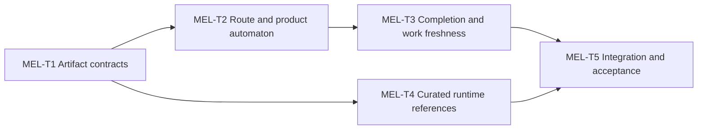

# Minimal Execution Loop Implementation Plan

> Status: implemented and accepted; see [`2026-07-10-minimal-execution-loop-acceptance.md`](../architecture/2026-07-10-minimal-execution-loop-acceptance.md)
>
> Architecture: [`2026-07-10-minimal-execution-loop.md`](../architecture/2026-07-10-minimal-execution-loop.md)

## Task List

### MEL-T1 — Land additive artifact contracts

**Scope**

- Add `route-decision.v1` and `execution-state.v1` JSON schemas and templates.
- Register both artifacts and add manifest producer/consumer flow.
- Add schema-contract checks for state vocabulary, workflow parity, closed objects, conditional fields, and template markers.
- Preserve all existing artifact schema semantics.

**Done**

- New contract tests fail before implementation and pass afterward.
- Existing `verification-record.v1` fixtures still pass unchanged.
- Canonical validator and artifact registry checks pass.

**Rollback**

- Remove only the additive registry, schema, template, manifest, and test entries.

### MEL-T2 — Implement strict route and product-automaton validation

**Scope**

- Add duplicate-key rejecting strict JSON loading and canonical digest helpers.
- Validate canonical work control root, route predecessor chain, operator pin, and route focus/obligation invariants.
- Validate global `recorded_sequence`, lifecycle transitions, workflow phase events, reached obligations, assurance bindings, block/resume context, and reroute successor state.
- Distinguish structural-only from gate-authorized results.

**Done**

- Positive routed/gated/executing/blocked/rerouted fixtures pass at the intended authority level.
- Obligation deletion, pin mismatch, old route replay, sequence gaps, invalid product windows, phase/cursor contradictions, and assurance downgrades fail.

**Rollback**

- Existing generic artifact validation remains usable even if strict authorization code is removed.

### MEL-T3 — Implement completion and governed-work freshness

**Scope**

- Implement claim projection, claim digest, as-of completion basis, attempt retry, and content-addressed terminal transition validation.
- Preserve legacy verification refs and add completion-envelope evidence snapshot bindings.
- Implement `git-worktree-content-v1`, governed ignore policy, double capture, symlink/mode/special-file/submodule handling, and closed control-bundle validation.
- Add explicit `--authorize-execution-state`, `--approved-route-digest`, and terminal-only `--approved-completion-digest` CLI behavior.

**Done**

- Frozen-field mutation matrix fails.
- Rejected attempt 1 cannot authorize attempt 2.
- Post-verification work/evidence mutation fails.
- Coordinated evidence plus in-bundle digest recomputation fails against the original operator completion pin.
- Generic artifact inspection remains backward compatible.
- Authority mode exits zero only for `gate-authorized` or `terminal-authorized`.

**Rollback**

- Disable/remove the new authority mode without changing legacy artifact-instance validation.

### MEL-T4 — Repair and enforce flattened public runtime references

**Scope**

- Rewrite canonical cross-phase skill links to flattened sibling links during curated export.
- Convert links to non-exported skills into non-link skill names rather than dangling paths.
- Validate all exported frontmatter, description bounds, packaged references, and generated-tree parity.
- Regenerate `skills/.curated/`.

**Done**

- The current broken cross-phase reference fixture fails before implementation and passes afterward.
- Every exported relative reference resolves within the generated tree.
- No machine-specific path appears in public artifacts.

**Rollback**

- Revert exporter and regenerated curated tree as one batch.

### MEL-T5 — Integrate guidance and self-hosted acceptance

**Scope**

- Update intake, verification, gateway, README, manifest, and relevant public guidance without making strict mode mandatory.
- Update threat model and ADR status according to actual implementation evidence.
- Create an ignored self-hosted strict bundle for this change and validate it against the final worktree.
- Run implementation-alignment, implementation-integrity, security, compatibility, and evidence-honesty reviews.

**Done**

- Focused tests, canonical validator, curated parity/loadability, and complete test suite pass on the final work state.
- Two independent final reviewers report no unresolved P0/P1.
- ADR status and README claims match the evidence exactly.

**Rollback**

- Documentation can return to proposed status without affecting legacy behavior.

## Dependency Graph

Critical path: `MEL-T1 -> MEL-T2 -> MEL-T3 -> MEL-T5`.

## Sequencing And Stop Conditions

1. Run the smallest RED test for each contract before production code.
2. Do not implement terminal completion before non-terminal route/state authorization is green.
3. Keep public-export repair as a separate reversible batch.
4. Stop and return to architecture if canonical digest, path containment, or reroute semantics require weakening a documented invariant.
5. Stop completion claims if any final review has unresolved P0/P1 or if any final evidence predates the final work snapshot.

## P2 Hardening Closure

> Status: implemented and adversarially reviewed on 2026-07-10

This follow-up stayed inside the repository-owned Direction 2 boundary:

- Git subprocesses use a fixed 300-second liveness guard. It prevents indefinite blocking; it is not a performance target or a reason to reject a large repository merely for being slow.
- Strict authority/control documents are bounded at 16 MiB. Raw evidence and governed worktree files are streamed in 1 MiB chunks while preserving `git-worktree-content-v1` identity.
- `--output-format json` exposes the current validation result without changing text defaults, exit codes, or authority semantics.
- Generic artifact inspection and strict authority share safe nonblocking descriptor semantics, while only strict authority applies the new 16 MiB policy so legacy generic inputs remain compatible. A completion candidate is emitted only when the bundle is otherwise valid and solely awaits the operator completion pin.

Named resource profiles, adaptive budgets, schedulers, host-specific timeout overrides, and Direction 3 runtime services were deliberately excluded. The first P2 review found three entry-path defects; they were reproduced, fixed, and added to the regression suite before acceptance was refreshed. The associated process analysis and unresolved design questions are recorded in [`2026-07-10-minimal-execution-loop-retrospective.md`](../architecture/2026-07-10-minimal-execution-loop-retrospective.md).
