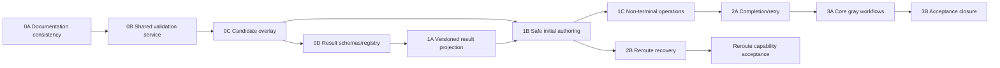

# Direction 2 Adoption Implementation Plan

> Status: ready for execution selection — 2026-07-12
>
> Architecture: [`2026-07-12-direction2-adoption-architecture.md`](../architecture/2026-07-12-direction2-adoption-architecture.md)
>
> ADR: [`ADR-004`](../adr/ADR-004-direction2-adoption-boundary.md)
>
> Risk register: [`2026-07-12-direction2-adoption-risk-register.md`](./2026-07-12-direction2-adoption-risk-register.md)

## Goal

Make the accepted Direction 2 protocol constructible without manual derived-field edits while preserving the existing authority boundary, legacy CLI behavior, full-worktree identity, and terminal repinning.

## Architecture

Implementation proceeds through three one-way modules:

- `tools/execution_validation.py` becomes the shared schema/registry/composed validation service for both CLIs and owns candidate bundle views;
- `tools/execution_authoring.py` owns pure protocol transformations and imports canonical projection/digest helpers from `tools/execution_state.py`;
- `tools/execution_result.py` owns immutable versioned authority/authoring result projections.

The existing validator remains authoritative. A new local authoring CLI serializes cooperating writers with a per-work lock, validates an in-memory effective bundle before materialization, and never auto-forwards candidates as pins.

## Technology And Compatibility

- Python 3.11 and 3.12 standard library
- Existing PyYAML and jsonschema dependencies
- Git CLI and local filesystem primitives
- `unittest`, Ruff, and mypy
- Existing `text` and four-field `json` output are frozen compatibility surfaces

## Non-Negotiable Invariants

1. No authoring command returns gate/terminal authority without a separately supplied explicit pin.
2. A candidate digest is never persisted or auto-forwarded as approval.
3. Existing `text`, unversioned JSON, domain exit codes, schemas, and legacy artifact behavior remain unchanged; the additive `json-v1` choice may only change `--help` and invalid-choice argparse text where the choice list is rendered.
4. Candidate prevalidation uses the shared service and effective bundle view; no CLI imports another CLI or copies semantic validation.
5. Lock guarantees apply only to cooperating local CLI writers; no distributed-CAS claim is introduced.
6. `invalid` requires proved no-net-change/exact predecessor restoration. Any canonical materialization that exists or cannot be ruled out without a proved clean predecessor/successor is `recovery-required`.
7. The 16 MiB hard limit applies independently to every created/replaced strict document; 12 MiB is warning/rollout-stop evidence.
8. Iteration 2B reroute is independently accepted and does not block core opt-in readiness.
9. No event store, identity system, scheduler, daemon, network API, rollover, scoped snapshot, or repin relaxation enters this plan.

## Public Authoring CLI Contract

The CLI path is `manage_execution_state.py` under `scripts/`. Every subcommand accepts `--output-format text|json-v1`; successful `written`/`candidate` results exit 0, domain `invalid`/`recovery-required` results exit 1, and argparse misuse exits 2. Complex evidence inputs are existing schema-shaped JSON or YAML documents, loaded with the same safe local-ref rules as canonical evidence.

| Subcommand | Required inputs | Conditional/repeatable inputs | Authored result |
|---|---|---|---|
| `route-draft` | `--repo-root`, `--work-id`, `--route-input` | None; approval time/evidence are explicit route-input fields | Non-authoritative draft plus route candidate. |
| `state-init` | `--repo-root`, `--work-id`, `--approved-route-digest`, repeated `--initial-binding`, `--transition-reason` | repeated `--transition-evidence-ref REF=SHA256`, `--occurred-at` | Byte-identical immutable route plus bindings for every `received -> routed` obligation and the routed transition as the final initial record. |
| `transition` | `--state`, `--expected-revision`, `--approved-route-digest`, `--target`, `--reason` | repeated `--evidence-ref REF=SHA256`, `--occurred-at` | One lifecycle transition and any coupled block/resume context. |
| `phase-event` | `--state`, `--expected-revision`, `--approved-route-digest`, `--kind entered|exited`, `--phase-index` | repeated `--evidence-ref REF=SHA256`, `--occurred-at` | One phase event and cursor update. |
| `artifact-bind` | `--state`, `--expected-revision`, `--approved-route-digest`, `--obligation-id`, `--artifact-ref`, `--subject-sha256` | Exactly the assurance-specific option required by the pinned route: none for `presence`, `--structural-evidence` for `structural_valid`, or `--approval` for `approval_accepted` | One closed binding; artifact and assurance are derived from the route obligation. |
| `claim-completion` | `--state`, `--expected-revision`, `--approved-route-digest`, `--verification-record-ref`, `--evidence-bindings`, `--reason` | `--occurred-at` | Claim transition, immutable attempt, verification commitment, work snapshot, and completion candidate. |
| `record-outcome` | `--state`, `--expected-revision`, `--approved-route-digest`, `--outcome verified|rejected|completed`, `--reason` | `--approved-completion-digest` is required only for `completed`; `--occurred-at` | Terminal/rejection transition, exact refs/binding changes, and candidate where applicable. |
| `reroute` | `--state`, `--expected-revision`, `--approved-route-digest`, `--next-route-input`, `--reason` | repeated `--evidence-ref REF=SHA256`, `--occurred-at` | Optional archive/route/selector transaction plus next route candidate. |

`--route-input`, every `--initial-binding`, `--structural-evidence`, `--approval`, and `--evidence-bindings` document is inspected as a non-symlink regular file. An initial-binding request is the same closed object used by `artifact-bind`: obligation ID, local artifact ref, subject digest, and exactly the assurance-specific evidence required by the pinned route. All local refs are POSIX-relative, content-bound, and control-root confined. `--help`, missing/extra/mutually-exclusive arguments, unsafe refs, and every output/exit combination have subprocess tests before gray use.

## File Responsibility Map

| File | Responsibility after implementation |
|---|---|
| `tools/execution_state.py` | Canonical strict IO, digest/projection logic, semantic replay, completion/work snapshot primitives. |
| `tools/execution_validation.py` | Shared artifact schema/registry validation, candidate bundle view, composed candidate validation. |
| `tools/execution_authoring.py` | Pure route/state authoring operations and coupled derived fields. |
| `tools/execution_result.py` | Authority/authoring v1 result payload projection. |
| `scripts/validate_prodcraft.py` | Repository validation CLI and legacy/versioned rendering adapter. |
| `manage_execution_state.py` under `scripts/` | Safe authoring CLI, local lock, transaction journal, materialization, recovery. |
| `schemas/protocol/registry.yml` | Versioned command-result schema discovery. |
| `schemas/protocol/*.schema.json` | Closed authority/authoring result contracts. |
| `tests/test_execution_validation.py` | Shared-service and overlay parity. |
| `tests/test_execution_result.py` | Schema/status/result projection contracts. |
| `tests/test_execution_authoring.py` | Pure mutation and derived-field behavior. |
| `tests/test_execution_authoring_cli.py` | CLI, compatibility, lock, atomic write, capacity. |
| `tests/test_execution_authoring_recovery.py` | State-init/reroute crash and recovery matrix. |
| `tests/test_execution_authoring_gray.py` | Three complete core adoption workflows. |

## Dependency Graph



Critical path for core opt-in readiness: `0A -> 0B -> 0C -> 0D -> 1A/1B -> 1C -> 2A -> 3A -> 3B`.

## Work Package Sizing

| Task | Estimate | Depends on | Done when |
|---|---:|---|---|
| 0A architecture contract | 0.5 day | approved design | Direction 2 is Accepted and Direction 3 remains non-normative. |
| 0B validation characterization/extraction | 1.5 days | 0A | Baseline is committed first; extraction preserves every non-additive output/exit contract. |
| 0C candidate overlay | 1.5 days | 0B | Overlay and materialized validation produce identical errors. |
| 0D result contracts | 1 day | 0C | Registry and all v1 statuses, including recovery-required, validate. |
| 1A result projections | 1 day | 0D | Legacy output is unchanged and `json-v1` validates. |
| 1B safe initialization | 2 days | 0C, 1A | Locking, no-clobber install, recovery, and capacity boundaries pass. |
| 1C non-terminal operations | 1.5 days | 1B | Lifecycle, phase, binding, and concurrent-writer matrices pass. |
| 2A-1 completion claim | 1.5 days | 1C | Only fresh, closed, accepted verification can produce a claim candidate. |
| 2A-2 terminal/retry | 1.5 days | 2A-1 | Verified/completed repin and rejected retry scenarios pass. |
| 2B-1 reroute recovery | 2 days | 1B | Every crash point recovers or stops on mismatch without overwriting. |
| 3A gray workflows | 1 day | 2A-2 | Three public-CLI workflows pass with measured friction and zero manual derived edits. |
| 3B acceptance closure | 1 day | 3A | Full matrix, self-host authority, and three independent reviews close P0/P1. |

Estimates are implementation effort, not elapsed calendar promises. Task 2B-1 is an optional parallel capability lane and is excluded from the core critical path.

## Iteration 0 — Contract Alignment And Shared Validation

### Task 0A: Accept The Cross-Document Architecture Contract

**Files**

- Modify: `docs/architecture/2026-07-10-minimal-execution-loop.md`
- Modify: `docs/architecture/2026-07-12-direction2-adoption-architecture.md`
- Modify: `docs/adr/ADR-004-direction2-adoption-boundary.md`
- Test: repository validator and cross-document search

**Steps**

- [ ] Change the Direction 3 event envelope heading from normative semantics to proposed, non-normative compatibility hypotheses.
- [ ] Replace the Direction 3 fitness rule that claims unambiguous semantics with a rule requiring fresh requirements/ADRs before implementation.
- [ ] Change ADR-004 and the adoption architecture from Proposed to Accepted in the same staged batch.
- [ ] Search for contradictory current/future claims:

```bash
rg -n "Normative semantics|Direction 3.*accepted|event stream becomes authoritative|implementation remains deferred" docs/architecture docs/adr
```

- [ ] Run:

```bash
python3 scripts/validate_prodcraft.py
git diff --check
```

Expected: validator passes; no accepted document describes Direction 3 event/CAS details as a current contract.

- [ ] Commit:

```bash
git add docs/architecture/2026-07-10-minimal-execution-loop.md \
  docs/architecture/2026-07-12-direction2-adoption-architecture.md \
  docs/adr/ADR-004-direction2-adoption-boundary.md
git commit -m "docs(architecture): accept Direction 2 adoption contract"
```

**Rollback:** revert only this documentation commit; no runtime behavior changes.

### Task 0B: Characterize And Extract The Shared Validation Service

**Files**

- Create: `tools/execution_validation.py`
- Modify: `scripts/validate_prodcraft.py`
- Modify: `tools/execution_state.py` only for public callback/protocol seams required by the service
- Create: `tests/test_execution_validation.py`
- Modify: `tests/test_execution_state_cli.py`

**Target service surface**

| Symbol | Exact responsibility |
|---|---|
| `CandidateBundleView(control_root, overrides, removals)` | Immutable effective view over live files, byte overrides, and removals. |
| `CandidateBundleView.read_bytes(relative_path) -> bytes` | Read override bytes first; reject removed, unsafe, symlinked, or non-regular paths. |
| `CandidateBundleView.sha256(relative_path) -> str` | Hash the exact bytes returned by `read_bytes`. |
| `CandidateBundleView.iter_relative_files()` | Return a sorted tuple of relative file-path strings from `(live - removals) union overrides`. |
| `validate_registered_artifact_payload(payload, source, errors) -> bool` | Preserve the existing registry/schema validation contract and error wording. |
| `validate_execution_candidate(repo_root, control_root, state_path, state, route, view, predecessor_routes, historical_states, approved_route_digest, approved_completion_digest) -> ValidationResult` | Compose repository, route, state, evidence, authority, and terminal validation over one effective view. |
| `ValidationDisposition` | Typed `valid`, `approval_required`, or `invalid` classification; a completion candidate is non-null if and only if the sole unmet authority condition is the explicit completion pin. No renderer parses error text. |

**Steps**

- [ ] Add characterization tests that capture exact return code/stdout/stderr for default and named/repeated `--check`, valid/invalid JSON and YAML artifact instances, authorize-only, check+artifact+authorize combinations, text/JSON rendering, missing/mismatched route and completion pins, gate authority, completion candidate, terminal authority, `--help`, and argparse misuse.
- [ ] Store expected payloads in test literals, not generated snapshots. Mark the additive `json-v1` choice-list delta explicitly rather than claiming byte identity for help/invalid-choice text that enumerates choices.
- [ ] Run the characterization tests against the unextracted implementation and commit the baseline independently:

```bash
python3 -m unittest tests.test_execution_state_cli
git add tests/test_execution_state_cli.py
git commit -m "test(validation): characterize execution CLI compatibility"
```

- [ ] Move artifact registry/schema loading and `validate_registered_artifact_payload`, route repository checks, execution instance checks, and terminal verification composition into `tools/execution_validation.py` without changing messages.
- [ ] Produce a typed `ValidationDisposition`; enforce candidate non-null if and only if completion-pin absence is the sole unmet authority condition. Remove error-list equality/string parsing from candidate suppression.
- [ ] Make `scripts/validate_prodcraft.py` import the service. Do not leave forwarding copies of moved validation logic in the CLI.
- [ ] Keep legacy public imports used by existing tests stable where practical; update test imports only when the moved function was never a supported public contract.
- [ ] Run:

```bash
python3 -m unittest tests.test_execution_validation tests.test_execution_state_cli
python3 scripts/validate_prodcraft.py
python3 -m ruff check tools/execution_validation.py scripts/validate_prodcraft.py \
  tests/test_execution_validation.py tests/test_execution_state_cli.py
python3 -m mypy tools/execution_state.py tools/execution_validation.py
git diff --check
```

Expected: all characterization outputs are identical to pre-extraction behavior.

- [ ] Commit:

```bash
git add tools/execution_validation.py tools/execution_state.py scripts/validate_prodcraft.py \
  tests/test_execution_validation.py tests/test_execution_state_cli.py
git commit -m "refactor(validation): extract shared execution validation service"
```

**Rollback:** revert the extraction commit as one unit; retain the independent characterization baseline.

### Task 0C: Add Candidate Bundle Overlay Parity

**Files**

- Modify: `tools/execution_validation.py`
- Modify: `tools/execution_state.py`
- Modify: `tests/test_execution_validation.py`
- Modify: `tests/test_execution_state_io.py`

**Steps**

- [ ] Write RED tests for override, removal, added path, unsafe relative path, duplicate path, effective enumeration, digest-from-override, and unbound effective file.
- [ ] Add a property-style fixture that validates the same candidate once through an in-memory view and once after materializing those exact bytes into an isolated control root; require identical error lists.
- [ ] Generalize control-bundle read/hash/enumeration through a narrow protocol or callbacks with current filesystem behavior as the default.
- [ ] Ensure overlay bytes never require a live temporary filename and that removals disappear from both reads and enumeration.
- [ ] Re-run existing FIFO/symlink/special-file and closure tests to prove the empty overlay preserves current safety.
- [ ] Run:

```bash
python3 -m unittest tests.test_execution_validation tests.test_execution_state_io
python3 -m ruff check tools/execution_state.py tools/execution_validation.py \
  tests/test_execution_validation.py tests/test_execution_state_io.py
python3 -m mypy tools/execution_state.py tools/execution_validation.py
```

- [ ] Commit:

```bash
git add tools/execution_state.py tools/execution_validation.py \
  tests/test_execution_validation.py tests/test_execution_state_io.py
git commit -m "feat(validation): validate effective candidate bundles"
```

**Rollback:** revert overlay support; no writer may land until this task is restored.

### Task 0D: Register Versioned Result Contracts

**Files**

- Create: `schemas/protocol/registry.yml`
- Create: `schemas/protocol/execution-authority-result.v1.schema.json`
- Create: `schemas/protocol/execution-authoring-result.v1.schema.json`
- Modify: `scripts/validate_prodcraft.py`
- Create: `tests/test_execution_result.py`

**Contract skeleton**

```yaml
schema_version: protocol-result-registry.v1
results:
  execution-authority-result:
    schema_version: execution-authority-result.v1
    schema_path: schemas/protocol/execution-authority-result.v1.schema.json
  execution-authoring-result:
    schema_version: execution-authoring-result.v1
    schema_path: schemas/protocol/execution-authoring-result.v1.schema.json
```

Both schemas use closed objects and exact fields/statuses from the approved architecture. Authoring status is `written|candidate|recovery-required|invalid`; `mutations[].action` is `create|replace|remove`; `capacities[]` is path-specific.

**Steps**

- [ ] Write RED registry tests for missing schema, mismatched `schema_version`, open objects, unknown status, malformed digest, duplicate YAML keys/result names, duplicate mutation/capacity paths, and unsafe `schema_path` values including traversal, absolute, backslash, URI, symlink, and non-regular targets.
- [ ] Add a `protocol-result-registry` repository check rather than registering command results as lifecycle artifacts.
- [ ] Validate representative authority and authoring payload fixtures for every status.
- [ ] Run:

```bash
python3 -m unittest tests.test_execution_result
python3 scripts/validate_prodcraft.py
python3 -m ruff check scripts/validate_prodcraft.py tests/test_execution_result.py
git diff --check
```

- [ ] Commit:

```bash
git add schemas/protocol scripts/validate_prodcraft.py tests/test_execution_result.py
git commit -m "feat(protocol): register versioned execution result contracts"
```

**Rollback:** remove the new check/registry/schemas together; no existing artifact registry entry changes.

## Iteration 1 — Versioned Results And Non-Terminal Authoring

### Task 1A: Implement Versioned Authority And Authoring Projections

**Files**

- Create: `tools/execution_result.py`
- Modify: `scripts/validate_prodcraft.py`
- Modify: `tests/test_execution_result.py`
- Modify: `tests/test_execution_state_cli.py`
- Modify: `README.md`
- Modify: `README.zh-CN.md`

**Target projection surface**

| Symbol | Input and output contract |
|---|---|
| `authority_result_v1` | Accepts `errors` and an optional `ValidationResult`; returns a schema-valid closed object with exactly one of `valid`, `approval-required`, or `invalid`. |
| `authoring_result_v1` | Accepts status, operation, mutations, optional revision/candidates, per-path capacities, warnings, and errors; returns a schema-valid closed object with exactly one of `written`, `candidate`, `recovery-required`, or `invalid`. |
| `Mutation` | Frozen value with exactly a relative path and `create|replace|remove` action; no internal digest leaks into the closed result contract. A recovery-required result may have no mutations when unresolved state prevents proving any exact side effect. |
| `Capacity` | Frozen value with relative path and exact used/warning/limit/remaining byte counts. |

**Steps**

- [ ] Write RED tests for authority `valid`, `approval-required`, and `invalid`; authoring `written`, `candidate`, `recovery-required`, and `invalid`; exact keys; schema validation; candidate suppression when any other error exists; proved rollback returning invalid; and pre-selector/post-selector unresolved materialization returning recovery-required with only attributable mutations.
- [ ] Implement frozen `Mutation` and `Capacity` dataclasses plus pure payload projectors.
- [ ] Add `json-v1` to validation CLI choices. Keep `text` and `json` branches unchanged and project from the same validated result.
- [ ] Preserve exit codes: domain valid/authorized `0`, approval-required/invalid `1`, argparse misuse `2`.
- [ ] Document both formats and the actor-authentication limitation in English/Chinese README.
- [ ] Run:

```bash
python3 -m unittest tests.test_execution_result tests.test_execution_state_cli
python3 -m ruff check tools/execution_result.py scripts/validate_prodcraft.py \
  tests/test_execution_result.py tests/test_execution_state_cli.py
python3 -m mypy tools/execution_result.py
git diff --check
```

- [ ] Commit:

```bash
git add tools/execution_result.py scripts/validate_prodcraft.py \
  tests/test_execution_result.py tests/test_execution_state_cli.py README.md README.zh-CN.md
git commit -m "feat(cli): add versioned execution authority results"
```

**Rollback:** remove only `json-v1` and the projection module; legacy output stays unchanged.

### Task 1B: Implement Safe Initial Route And State Authoring

**Files**

- Modify: `tools/execution_state.py`
- Create: `tools/execution_authoring.py`
- Create: `manage_execution_state.py` under `scripts/`
- Create: `tests/test_execution_authoring.py`
- Create: `tests/test_execution_authoring_cli.py`
- Create: `tests/test_execution_authoring_recovery.py`
- Modify: `README.md`
- Modify: `README.zh-CN.md`

**Core authoring surface**

| Symbol | Exact responsibility |
|---|---|
| `AuthoredChange` | Frozen value containing document bytes, removals, optional state revision, and optional route/completion candidates. |
| `draft_initial_route(route) -> AuthoredChange` | Canonicalize route-derived fields and return candidate bytes without writing or approving them. |
| `initialize_state(route_bytes, approved_route_digest, initial_bindings, transition_reason, transition_evidence, occurred_at) -> AuthoredChange` | Verify reviewed bytes and route pin; require exactly every `received -> routed` obligation; append bindings in route declaration order and the routed transition last; do not change route bytes. |
| Narrow public route/record digest helpers in `execution_state` | Canonical route and append-record projection/digest functions used by authoring and validation; their field exclusion sets remain defined once. |

**Steps**

- [ ] Write RED pure tests proving route digest uses canonical route projection rather than raw file SHA; `state-init` installs reviewed draft bytes unchanged; consumes exactly all `received -> routed` obligations; orders bindings by route declaration rather than request order; appends the transition last; and sets revision to binding count plus one.
- [ ] Add one-obligation/multiple-obligation tests plus missing, duplicate, unknown, extra, wrong-assurance, invalid-evidence, and mismatched-subject initial binding requests. Every invalid request leaves route/state/draft bytes unchanged.
- [ ] Write RED CLI tests for top-level/intermediate symlink, unsafe `work_id`, existing state, existing immutable route, mismatched semantic pin, and modified draft bytes.
- [ ] Add route-draft negative matrices for invalid schema, invalid route semantics, missing/mismatched approval-evidence content digest, and unsafe referenced evidence; require no authoritative file and no candidate on any outer error.
- [ ] Promote and test only the narrow route and append-record canonical projection/digest helpers needed by initial authoring; remove any need to import private helpers or copy exclusion lists.
- [ ] Implement safe create-path resolution independent of `resolve_authority_context()`.
- [ ] Implement the per-work Git-common-dir lock using a non-symlink regular file and fail closed when locking is unavailable.
- [ ] Implement state-init journal publication/flush, destination-local no-clobber route install, selector-last commit, draft cleanup, and process-crash recovery branches. Do not claim power-loss, kernel, storage, or filesystem-corruption recovery.
- [ ] Implement exact per-path capacity calculation at `12 MiB−1`, `12 MiB`, `16 MiB`, and `16 MiB+1`; reject the entire mutation if either route or state exceeds the hard limit.
- [ ] Validate the candidate bundle view before materialization and compare source raw digest immediately before commit.
- [ ] Add text and `json-v1` authoring output; never include or persist the supplied pin. Inject pre-selector immutable-file mismatch/removal failure and post-selector validation/cleanup failure; require `recovery-required`, nonzero exit, null candidates, and only provable mutations (possibly empty when attribution is impossible).
- [ ] Document route draft/state initialization, closed initial-binding inputs, deterministic binding/transition order, explicit pins, result statuses, process-crash recovery, manual-review escalation, and the unsupported power-loss boundary in both reader guides.
- [ ] Run:

```bash
AUTHORING_CLI="scripts"/manage_execution_state.py
python3 -m unittest tests.test_execution_authoring tests.test_execution_authoring_cli \
  tests.test_execution_authoring_recovery
python3 -m ruff check tools/execution_state.py tools/execution_authoring.py "$AUTHORING_CLI" \
  tests/test_execution_authoring*.py
python3 -m mypy tools/execution_state.py tools/execution_authoring.py "$AUTHORING_CLI"
git diff --check
```

- [ ] Commit:

```bash
AUTHORING_CLI="scripts"/manage_execution_state.py
git add tools/execution_state.py tools/execution_authoring.py "$AUTHORING_CLI" \
  tests/test_execution_authoring.py tests/test_execution_authoring_cli.py \
  tests/test_execution_authoring_recovery.py README.md README.zh-CN.md
git commit -m "feat(authoring): add safe route and state initialization"
```

**Rollback:** revert this commit; versioned validation output remains independently useful.

### Task 1C: Implement Non-Terminal State Operations

**Files**

- Modify: `tools/execution_authoring.py`
- Modify: `manage_execution_state.py` under `scripts/`
- Modify: `tests/test_execution_authoring.py`
- Modify: `tests/test_execution_authoring_cli.py`
- Modify: `README.md`
- Modify: `README.zh-CN.md`

**Operations**

| Symbol | Required inputs and coupled effects |
|---|---|
| `append_transition` | Current bundle, `expected_revision`, target, timestamp, and target-specific context; appends one legal transition plus any required blocked/resume coupling. |
| `append_phase_event` | Current bundle, `expected_revision`, event kind, phase index, timestamp, and evidence; appends one legal phase checkpoint. |
| `bind_artifact` | Current bundle, `expected_revision`, obligation ID, local artifact ref/digest, and assurance-specific evidence; derives artifact/assurance from the pinned route and binds exactly one satisfied obligation. |

**Steps**

- [ ] Write RED mutation-matrix tests for every legal/illegal lifecycle edge and phase checkpoint.
- [ ] Add block-context coupling tests: entering blocked records context; resuming updates its exact resume transition in the same authored change.
- [ ] Add obligation tests for missing/duplicate binding, wrong artifact, wrong assurance, stale evidence digest, and gate-after-binding order.
- [ ] Add closed binding-request matrices: `presence` rejects structural/approval extras; `structural_valid` requires validator ID/version/check set/passed result plus content-bound evidence; `approval_accepted` requires accepted status, approver/time, matching subject digest, and content-bound evidence.
- [ ] For `transition`, `phase-event`, and `artifact-bind`, test missing, malformed, mismatched, and stale route pins. Every case exits 1 with `status: invalid`, `mutations: []`, and byte-identical canonical state.
- [ ] Add a two-process barrier test: both callers start with revision N; the lock winner commits N+1; the second re-reads and fails without modifying N+1.
- [ ] Reuse the route/append-record projection and digest helpers exposed in Task 1B; do not promote another helper or copy exclusion lists.
- [ ] Wire CLI subcommands `transition`, `phase-event`, and `artifact-bind` through the shared transaction path.
- [ ] Document every non-terminal command, assurance-specific binding input, and route-pin precondition in both reader guides.
- [ ] Run focused tests, then the full execution-state suite.

```bash
AUTHORING_CLI="scripts"/manage_execution_state.py
python3 -m unittest tests.test_execution_authoring tests.test_execution_authoring_cli \
  tests.test_execution_state_contract tests.test_execution_state_completion
python3 -m ruff check tools/execution_state.py tools/execution_authoring.py \
  "$AUTHORING_CLI" tests/test_execution_authoring.py tests/test_execution_authoring_cli.py
python3 -m mypy tools/execution_state.py tools/execution_authoring.py "$AUTHORING_CLI"
git diff --check
```
- [ ] Commit:

```bash
AUTHORING_CLI="scripts"/manage_execution_state.py
git add tools/execution_state.py tools/execution_authoring.py "$AUTHORING_CLI" \
  tests/test_execution_authoring.py tests/test_execution_authoring_cli.py \
  README.md README.zh-CN.md
git commit -m "feat(authoring): add non-terminal execution operations"
```

**Rollback:** revert this operation batch; initial route/state authoring remains usable.

## Iteration 2A — Completion And Retry Authoring

### Task 2A-1: Construct Completion Claims From Fresh Verification

**Files**

- Modify: `tools/execution_authoring.py`
- Modify: `tools/execution_validation.py`
- Modify: `manage_execution_state.py` under `scripts/`
- Modify: `tests/test_execution_authoring.py`
- Modify: `tests/test_execution_authoring_cli.py`
- Modify: `README.md`
- Modify: `README.zh-CN.md`

**Steps**

- [ ] Write RED tests rejecting verification records that are non-accepted, `claim_may_be_made: false`, contain failed checks, retain remaining scope, predate work, omit an evidence-ID snapshot, reuse prior-attempt evidence, or disagree with claim/work state.
- [ ] Test missing, malformed, mismatched, and stale route pins for `claim-completion`; require exit 1, `status: invalid`, `mutations: []`, and byte-identical canonical state.
- [ ] Add `validate_completion_preflight()` to the shared service; do not rely on terminal-only validation paths.
- [ ] Implement `claim_completion()` to capture the work snapshot and atomically append the claim transition plus immutable attempt/verification commitment.
- [ ] Recompute `claim_digest` and `completion_basis_digest` through existing canonical projections; never duplicate their field lists.
- [ ] Add full-worktree mutation tests before and after claim.
- [ ] Document the claim command, evidence-binding input, route-pin precondition, and candidate-only authority boundary in both reader guides.
- [ ] Run:

```bash
AUTHORING_CLI="scripts"/manage_execution_state.py
python3 -m unittest tests.test_execution_authoring tests.test_execution_authoring_cli \
  tests.test_execution_state_completion
python3 -m ruff check tools/execution_authoring.py tools/execution_validation.py \
  "$AUTHORING_CLI" tests/test_execution_authoring*.py
python3 -m mypy tools/execution_authoring.py tools/execution_validation.py "$AUTHORING_CLI"
```

- [ ] Commit:

```bash
AUTHORING_CLI="scripts"/manage_execution_state.py
git add tools/execution_authoring.py tools/execution_validation.py "$AUTHORING_CLI" \
  tests/test_execution_authoring.py tests/test_execution_authoring_cli.py \
  README.md README.zh-CN.md
git commit -m "feat(authoring): construct completion attempts from fresh evidence"
```

**Rollback:** revert completion authoring while retaining non-terminal operations.

### Task 2A-2: Record Verification, Rejection, Completion, And Retry

**Files**

- Modify: `tools/execution_authoring.py`
- Modify: `manage_execution_state.py` under `scripts/`
- Modify: `tests/test_execution_authoring.py`
- Modify: `tests/test_execution_authoring_cli.py`
- Modify: `tests/test_execution_state_completion.py`
- Modify: `README.md`
- Modify: `README.zh-CN.md`

**Steps**

- [ ] Write RED tests for `completion_claimed -> verified`, `completion_claimed -> rejected`, `verified -> completed`, invalid terminal edge, missing reason, stale verified pin, and candidate suppression with any outer error.
- [ ] For every `record-outcome`, test missing/mismatched route pins; for `verified -> completed`, additionally test missing/malformed/mismatched/stale completion pins. Every failure exits 1 with `status: invalid`, `mutations: []`, and byte-identical canonical state.
- [ ] Prove rejected outcome retains no completion binding and does not rewrite the accepted pre-claim verification record.
- [ ] Prove retry requires `rejected -> gated -> executing`, a new attempt revision, new verification-record digest, and fresh evidence IDs/snapshots.
- [ ] Implement terminal refs/binding as one authored change; return but never auto-forward the completion candidate.
- [ ] Require the verified-state pin before authoring `verified -> completed`, then return a different completed-state candidate.
- [ ] Add subprocess text/JSON-v1 scenarios for candidate, verified authority, rejected retry, and completed repin.
- [ ] Document claim, reviewer outcome, retry, route-pin, and verified-to-completed repin workflows in both reader guides.
- [ ] Run:

```bash
AUTHORING_CLI="scripts"/manage_execution_state.py
python3 -m unittest tests.test_execution_authoring tests.test_execution_authoring_cli \
  tests.test_execution_state_completion
python3 -m ruff check tools/execution_authoring.py "$AUTHORING_CLI" \
  tests/test_execution_authoring.py tests/test_execution_authoring_cli.py \
  tests/test_execution_state_completion.py
python3 -m mypy tools/execution_authoring.py "$AUTHORING_CLI"
git diff --check
```

- [ ] Commit:

```bash
AUTHORING_CLI="scripts"/manage_execution_state.py
git add tools/execution_authoring.py "$AUTHORING_CLI" \
  tests/test_execution_authoring.py tests/test_execution_authoring_cli.py \
  tests/test_execution_state_completion.py README.md README.zh-CN.md
git commit -m "feat(authoring): record terminal outcomes and retries"
```

**Rollback:** revert terminal/retry authoring; completion-claim construction remains diagnostic-only until restored.

## Iteration 2B — Optional Reroute Transaction And Recovery

### Task 2B-1: Implement Recoverable Reroute

**Files**

- Modify: `tools/execution_authoring.py`
- Modify: `manage_execution_state.py` under `scripts/`
- Modify: `tests/test_execution_authoring_recovery.py`
- Modify: `tests/test_execution_authoring_cli.py`
- Modify: `README.md`
- Modify: `README.zh-CN.md`

**Steps**

- [ ] Build a crash matrix covering manifest publication, each destination-local temp, archive link, route link, selector replace, validation, temp cleanup, and journal cleanup.
- [ ] Test missing/malformed/mismatched/stale current route pins before any reroute materialization; require exit 1, `status: invalid`, `mutations: []`, and byte-identical canonical files.
- [ ] Implement an atomically published/flushed journal recording predecessor/successor selector digests, initial-absence facts, final/temp paths, devices, and exact content digests.
- [ ] Assert each destination-local temp shares `st_dev` with the control root.
- [ ] Install immutable archive/route with atomic no-clobber hard links; never overwrite a pre-existing final path.
- [ ] Replace selector last as commit point.
- [ ] Implement predecessor recovery: absent means not materialized; present+matching is removed; mismatch stops for manual review.
- [ ] Implement successor recovery: all immutable finals must exist/match; matching/absent temps are cleaned; mismatch stops.
- [ ] Ensure result `mutations` reports archive create, route create, selector replace and per-path capacities.
- [ ] Document reroute as separately accepted optional capability, including recovery/manual-review behavior and current/next route pin boundaries.
- [ ] Inject authoring-process termination at every matrix point and state explicitly that host/power-loss durability is untested and unsupported. Require `recovery-required` whenever a later invocation cannot prove clean predecessor rollback or successor completion.
- [ ] Run the crash matrix repeatedly and the existing reroute/predecessor-chain suite:

```bash
AUTHORING_CLI="scripts"/manage_execution_state.py
python3 -m unittest tests.test_execution_authoring_recovery \
  tests.test_execution_authoring_cli tests.test_execution_state_contract \
  tests.test_execution_state_validator tests.test_execution_state_cli
python3 -m ruff check tools/execution_authoring.py "$AUTHORING_CLI" \
  tests/test_execution_authoring_recovery.py tests/test_execution_authoring_cli.py
python3 -m mypy tools/execution_authoring.py "$AUTHORING_CLI"
git diff --check
```
- [ ] Commit:

```bash
AUTHORING_CLI="scripts"/manage_execution_state.py
git add tools/execution_authoring.py "$AUTHORING_CLI" \
  tests/test_execution_authoring_recovery.py tests/test_execution_authoring_cli.py \
  README.md README.zh-CN.md
git commit -m "feat(authoring): add recoverable reroute transactions"
```

**Rollback:** revert this commit only; do not advertise authoring support for reroute. Core adoption remains intact.

## Iteration 3 — Gray Adoption And Acceptance

### Task 3A: Exercise Three Core Gray Workflows

**Files**

- Create: `tests/test_execution_authoring_gray.py`
- Create after execution: `docs/architecture/2026-07-12-direction2-adoption-gray-record.md`
- Modify only if a confirmed defect is found: authoring, validation, or result modules and their focused tests

**Scenarios**

1. route draft -> state init with intake binding(s) and routed transition -> gated -> executing -> completion_claimed -> verified -> completed;
2. executing -> blocked -> resumed -> completed;
3. completion_claimed -> rejected -> gated -> executing -> fresh retry -> completed.

**Metrics captured after every command**

- manual edits to sequence, digest, and binding fields;
- mutation paths and actions;
- used, warning, limit, and remaining bytes per strict document;
- invalid writes prevented;
- unrelated-worktree rejections;
- route and completion pin count;
- approval turnaround measured from operator review request to supplied pin;
- whether the run is automated or observed with separate author/reviewer roles.

**Steps**

- [ ] Write deterministic end-to-end subprocess scenarios using only public CLI commands; direct fixture writes are limited to external evidence documents that the CLI intentionally consumes.
- [ ] Assert zero manual edits to route/state derived fields.
- [ ] Assert all invalid operations preserve canonical bytes.
- [ ] Run at least one observed gray workflow with separate author and reviewer roles. Record automation flag, reviewer role, request timestamp, supplied-pin timestamp, invalid-operation sample count, false-rejection count, and exact pin count; do not present test-process latency as human approval turnaround.
- [ ] Record actual metrics without invented values in the gray record.
- [ ] Stop and reopen architecture if any non-synthetic gray state reaches 12 MiB, manual digest repair is needed, a full-worktree false rejection repeats, or pin handling is bypassed.
- [ ] Run the gray test and style gates:

```bash
python3 -m unittest tests.test_execution_authoring_gray
python3 -m ruff check tests/test_execution_authoring_gray.py
git diff --check
```

- [ ] Commit tests and evidence only after all three scenarios pass:

```bash
git add tests/test_execution_authoring_gray.py \
  docs/architecture/2026-07-12-direction2-adoption-gray-record.md
git commit -m "test(adoption): exercise Direction 2 gray workflows"
```

**Rollback:** remove the gray evidence/test commit; strict opt-in readiness returns to pending.

### Task 3B: Close Acceptance On One Final Work Snapshot

**Files**

- Modify: `docs/architecture/2026-07-12-direction2-adoption-architecture.md`
- Modify: `docs/adr/ADR-004-direction2-adoption-boundary.md` only if status or evidence wording needs final alignment
- Create: `docs/architecture/2026-07-12-direction2-adoption-acceptance.md`
- Regenerate ignored: `.prodcraft/artifacts/prodcraft-direction2/`

**Steps**

- [ ] Request three independent read-only reviews: architecture/trust, implementation/filesystem integrity, and compatibility/developer experience. Close every P0/P1, commit each bounded fix, and rerun each original reproduction.
- [ ] Draft the tracked acceptance record with consensus, unresolved P2, exact gate commands, and the requirement for a post-commit external attestation. Include one machine-readable `adoption_base:` line whose value is exactly the full lowercase 40-hex pre-implementation commit. Do not claim or embed the record's own future commit hash, final work snapshot, or self-host pins.
- [ ] Stage the complete tracked acceptance batch, inspect its exact diff, and obtain final reviewer confirmation that no P0/P1 remains in the staged content.
- [ ] Commit all tracked acceptance content before self-host regeneration:

```bash
git add docs/architecture/2026-07-12-direction2-adoption-architecture.md \
  docs/adr/ADR-004-direction2-adoption-boundary.md \
  docs/architecture/2026-07-12-direction2-adoption-acceptance.md
git commit -m "docs(acceptance): record Direction 2 adoption evidence"
```

- [ ] Freeze that tracked HEAD. In the same shell used for the remaining final-attestation commands, require clean status and make `FINAL_HEAD` read-only. Make no further tracked changes unless the entire sequence restarts after a new commit:

```bash
test -z "$(git status --porcelain)"
FINAL_HEAD=$(git rev-parse HEAD)
readonly FINAL_HEAD
```

- [ ] Record the actual interpreters, then run the Python 3.12 full suite:

```bash
python3 --version
python3 -c 'import sys; assert sys.version_info[:2] == (3, 12), sys.version'
python3 -m unittest discover -s tests
```

- [ ] Run Python 3.11 with declared dependencies:

```bash
UV_CACHE_DIR=/tmp/uv-cache-prodcraft uv run --python 3.11 python --version
UV_CACHE_DIR=/tmp/uv-cache-prodcraft uv run --python 3.11 \
  python -c 'import sys; assert sys.version_info[:2] == (3, 11), sys.version'
UV_CACHE_DIR=/tmp/uv-cache-prodcraft uv run --python 3.11 \
  --with pyyaml --with jsonschema python -m unittest discover -s tests
```

- [ ] Run repository, distribution, type, and style gates:

```bash
AUTHORING_CLI="scripts"/manage_execution_state.py
python3 scripts/validate_prodcraft.py
python3 -m ruff check tools/execution_*.py scripts/validate_prodcraft.py \
  "$AUTHORING_CLI" tests/test_execution_*.py
python3 -m mypy tools/execution_state.py tools/execution_validation.py \
  tools/execution_authoring.py tools/execution_result.py "$AUTHORING_CLI"
git diff --check
```

- [ ] Run the exact distribution, reference/loadability, and unchanged-skill/eval canary gates. `ADOPTION_BASE` is the commit recorded in the tracked acceptance document:

```bash
ADOPTION_BASE=$(sed -nE 's/^adoption_base: ([0-9a-f]{40})$/\1/p' \
  docs/architecture/2026-07-12-direction2-adoption-acceptance.md)
test "${#ADOPTION_BASE}" -eq 40
git cat-file -e "$ADOPTION_BASE^{commit}"
python3 scripts/validate_prodcraft.py --check skill-frontmatter --check curated-surface
python3 -m unittest tests.test_curated_distribution_surface \
  tests.test_skill_gotchas tests.test_external_skill_integration_boundary
git diff --exit-code "$ADOPTION_BASE"..HEAD -- skills eval \
  scripts/run_explicit_skill_benchmark.py
```

- [ ] Regenerate the ignored self-host bundle through the authoring CLI, not `CompletionFixture`, on `FINAL_HEAD`.
- [ ] Prove no-pin returns only a candidate, route pin gives gate authority where applicable, and current route plus completion pins return `terminal-authorized`.
- [ ] Prove the attested tracked snapshot did not move:

```bash
test "$(git rev-parse HEAD)" = "$FINAL_HEAD"
test -z "$(git status --porcelain)"
```

- [ ] Emit the external final attestation in the delivery report: exact `FINAL_HEAD`, work snapshot, route/completion pins, command/exit summaries, reviewer consensus, unresolved P2, and confirmation that tracked status remained clean after regeneration. Never write pins into the writable bundle or back into a tracked acceptance document.

**Rollback:** revert acceptance status/evidence only; implemented authoring remains opt-in but not promoted. Any tracked correction after the acceptance commit invalidates the attestation and restarts Task 3B from review.

## Per-Commit Gate

Before every commit:

1. inspect `git status --short` and the exact staged diff;
2. run narrow tests;
3. run Ruff and mypy on changed modules;
4. run the repository validator when docs, contracts, or registries change;
5. run `git diff --cached --check`;
6. confirm there are no unrelated skill, eval, benchmark, or canary changes;
7. use the exact planned subject unless behavior differs.

Do not combine tasks into one mega-commit. Do not push unless explicitly requested.

## Stop Conditions

Stop the iteration and return to architecture intake if any of the following becomes required or true:

- writer identity must be authenticated;
- non-cooperating, shared-filesystem, multi-host, or distributed writers must be supported;
- overlay validation cannot be proven equivalent to materialized validation;
- canonical projections require duplicated field lists;
- a v1 result schema needs an incompatible change;
- any non-synthetic gray/adoption state document reaches 12 MiB;
- a narrower work snapshot or reduced repin contract becomes necessary for usability;
- Direction 3 event, scheduler, service, or distributed-CAS runtime becomes necessary.
